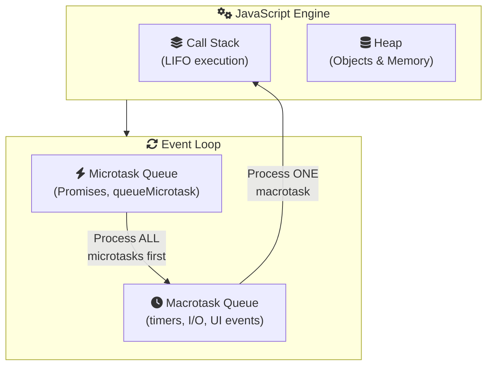
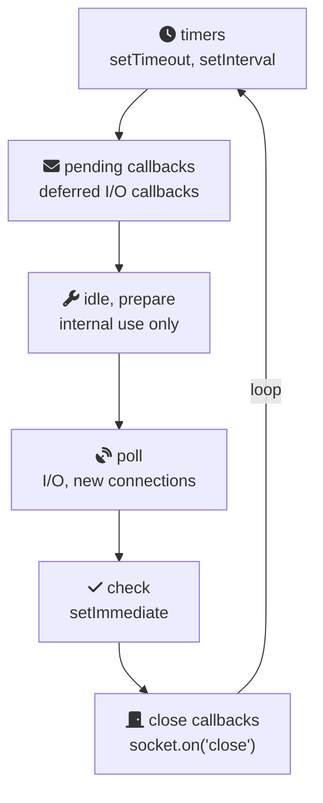

# Event Loop Internals

The event loop is the heart of JavaScript's concurrency model. Understanding its internals is crucial for writing high-performance applications and debugging complex async scenarios.

## The Complete Picture

The JavaScript runtime interacts with the event loop through several components:



## Event Loop Phases (Browser)

Each iteration of the event loop follows these phases:

1. **Execute script** - Run synchronous code
2. **Microtask checkpoint** - Drain the entire microtask queue
3. **Rendering opportunity** - Browser may paint (≈60fps target)
4. **Macrotask** - Execute one macrotask
5. **Repeat**

```javascript
// This creates an infinite loop that never paints!
function blockForever() {
  Promise.resolve().then(blockForever);
}
// blockForever(); // Don't run this!

// This allows rendering between iterations
function allowPaint() {
  setTimeout(allowPaint, 0); // Macrotask - allows paint between
}
```

<EventLoopVisualizer showMicrotasks={true} />

## Node.js Event Loop Differences

Node.js has additional phases:



## Advanced: queueMicrotask vs Promise

```javascript
// queueMicrotask is cleaner for scheduling microtasks
queueMicrotask(() => console.log("Direct microtask"));

// vs
Promise.resolve().then(() => console.log("Promise microtask"));

// Both run in the same microtask checkpoint
// queueMicrotask has slightly less overhead
```

## Performance Patterns

### Avoiding Starvation

```javascript
// Bad: Recursive microtasks starve macrotasks and rendering
function badPattern() {
  Promise.resolve().then(badPattern);
}

// Good: Use macrotasks for long-running work
function goodPattern() {
  // Process chunk
  if (moreWork) {
    setTimeout(goodPattern, 0); // Yields to event loop
  }
}

// Better: Use requestIdleCallback for low-priority work
function betterPattern() {
  requestIdleCallback((deadline) => {
    while (deadline.timeRemaining() > 0 && moreWork) {
      processChunk();
    }
    if (moreWork) requestIdleCallback(betterPattern);
  });
}
```

### Batching Updates

```javascript
let pending = false;
let updates = [];

function scheduleUpdate(update) {
  updates.push(update);
  if (!pending) {
    pending = true;
    queueMicrotask(() => {
      const batch = updates;
      updates = [];
      pending = false;
      applyBatchedUpdates(batch); // Process all at once
    });
  }
}
```

## Common Gotchas

```javascript
// 1. setTimeout(fn, 0) isn't really 0ms
// Minimum delay is ~4ms after 5 nested timeouts

// 2. Microtasks can delay rendering
for (let i = 0; i < 1000000; i++) {
  Promise.resolve().then(() => {}); // UI freezes!
}

// 3. Event handlers run before microtasks drain
button.click(); // Synchronous
Promise.resolve().then(() => console.log("after click handler"));
```

<ProgressCheckpoint section="task-queues" xpReward={60} />
