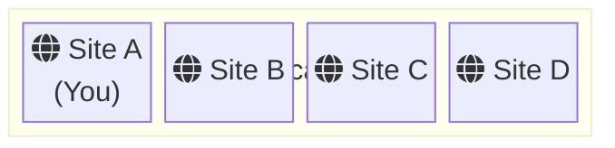
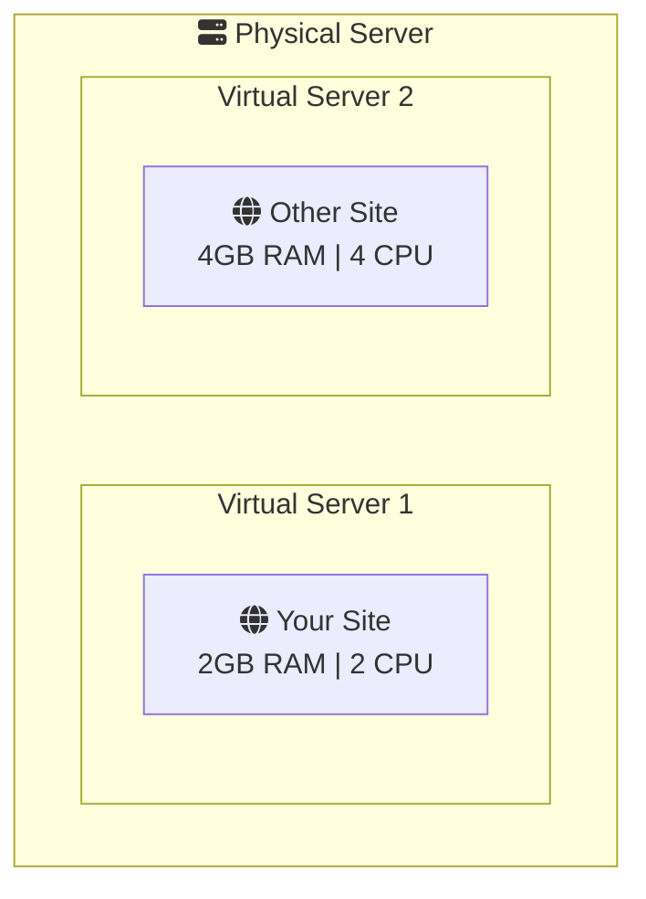

# What is Hosting? — Intermediate

Now that you understand the basics of web hosting, let's dive deeper into the different hosting types and learn how to choose the right one for your projects.

## Hosting Types Compared

Each hosting type has its own strengths and trade-offs. Understanding these will help you make informed decisions as your projects grow.

<HostingTypeSelector showComparison />

<ProgressCheckpoint section="introduction" xpReward={20} />

## Shared Hosting Deep Dive

**Shared hosting** is where multiple websites share the same server resources — CPU, RAM, and storage.

### How It Works

> All sites share the same CPU, RAM, and storage resources

### Pros
- **Cost-effective**: $3-15/month
- **Managed**: Provider handles server maintenance
- **Easy setup**: One-click installs for WordPress, etc.

### Cons
- **Resource limits**: Other sites can slow you down
- **Security risks**: Vulnerabilities in neighboring sites
- **Limited control**: Can't install custom software

<InfoBox type="info" title="When to Use Shared Hosting">
Perfect for personal blogs, portfolio sites, small business websites, and any site expecting less than 10,000 monthly visitors.
</InfoBox>

<ProgressCheckpoint section="hosting-basics" xpReward={20} />

## VPS (Virtual Private Server)

A **VPS** uses virtualization to give you dedicated resources on a shared physical machine.

### How It Works

> Each VPS has guaranteed, isolated resources

### Key Differences from Shared
- **Guaranteed resources**: Your 2GB RAM is always yours
- **Root access**: Install any software you need
- **Isolation**: Other sites can't affect your performance

<Comparison 
  left={{ title: "Shared Hosting", items: ["Resources shared", "No root access", "Provider manages everything", "$3-15/month"] }}
  right={{ title: "VPS Hosting", items: ["Dedicated resources", "Full root access", "You manage your server", "$20-100/month"] }}
/>

<ProgressCheckpoint section="hosting-types" xpReward={25} />

## Dedicated Servers

A **dedicated server** means you rent an entire physical machine exclusively for your use.

### When You Need Dedicated
- High-traffic websites (100,000+ monthly visitors)
- Resource-intensive applications
- Strict compliance requirements (HIPAA, PCI-DSS)
- Maximum security needs

### Considerations
- **Cost**: $100-500+/month
- **Expertise**: You need sysadmin skills or hire someone
- **Responsibility**: Hardware failures are your problem

## Cloud Hosting

**Cloud hosting** distributes your website across multiple connected servers.

<ServerArchitectureDiagram type="load-balanced" />

### Key Benefits

1. **Scalability**: Add resources instantly during traffic spikes
2. **Reliability**: If one server fails, others take over
3. **Pay-as-you-go**: Only pay for what you use

### Popular Cloud Providers
- **AWS (Amazon Web Services)**: Most comprehensive
- **Google Cloud Platform**: Great for data/ML
- **Microsoft Azure**: Enterprise-focused
- **DigitalOcean/Linode**: Developer-friendly, simpler

<InfoBox type="warning" title="Cloud Cost Warning">
Cloud hosting can get expensive quickly! A misconfigured service or traffic spike can result in unexpected bills. Always set up billing alerts and spending limits.
</InfoBox>

<ProgressCheckpoint section="server-architecture" xpReward={20} />

## Choosing the Right Hosting

Use this decision framework:

### Traffic & Scale
| Monthly Visitors | Recommended |
|-----------------|-------------|
| < 10,000 | Shared Hosting |
| 10,000 - 100,000 | VPS |
| 100,000 - 1,000,000 | Cloud or Dedicated |
| 1,000,000+ | Cloud with CDN |

### Technical Skill
| Your Level | Recommended |
|------------|-------------|
| Beginner | Shared (managed) |
| Intermediate | Managed VPS |
| Advanced | Unmanaged VPS or Cloud |
| Expert | Dedicated or Custom Cloud |

### Budget
| Budget/Month | Options |
|--------------|---------|
| $0-20 | Shared, Basic VPS |
| $20-100 | VPS, Entry Cloud |
| $100-500 | Dedicated, Cloud |
| $500+ | Enterprise Cloud |

<ProgressCheckpoint section="deployment" xpReward={15} />

## Quiz

<Quiz>
  <Question text="What's the main advantage of VPS over shared hosting?">
    <Answer>It's cheaper</Answer>
    <Answer correct>You get guaranteed, dedicated resources</Answer>
    <Answer>It's easier to set up</Answer>
    <Answer>It doesn't require a domain name</Answer>
  </Question>
  
  <Question text="When would cloud hosting be the best choice?">
    <Answer>For a small personal blog</Answer>
    <Answer>When you have a fixed, predictable traffic</Answer>
    <Answer correct>When you need to scale quickly based on demand</Answer>
    <Answer>When you want the cheapest option</Answer>
  </Question>
  
  <Question text="What's a potential downside of cloud hosting?">
    <Answer>It can't handle high traffic</Answer>
    <Answer>It's not reliable</Answer>
    <Answer correct>Costs can be unpredictable</Answer>
    <Answer>It doesn't support modern frameworks</Answer>
  </Question>
</Quiz>

<ProgressCheckpoint section="summary" xpReward={10} />

---

**Great progress!** 🚀 You now understand the different hosting types and when to use each. In the advanced level, we'll explore server architecture, load balancing, CDNs, and deployment strategies.
