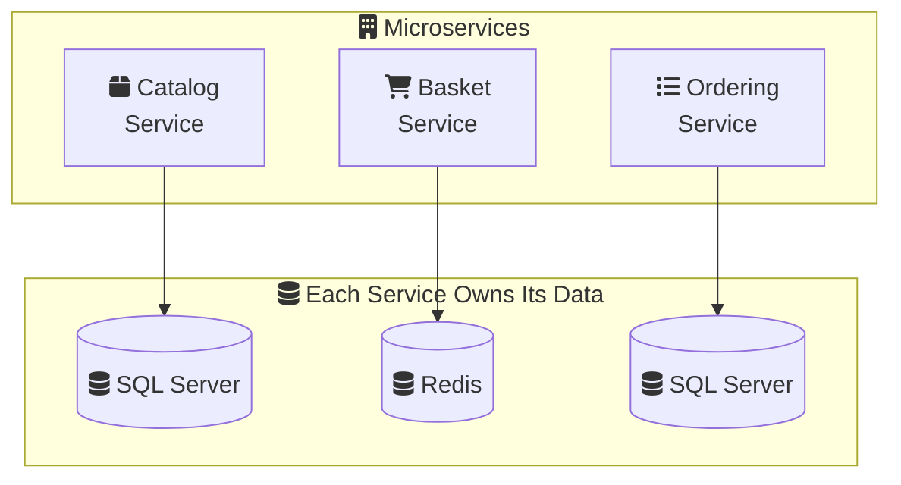

# Microservices Principles

Microservices architecture structures an application as a collection of loosely coupled, independently deployable services. Each service is owned by a small team and implements a specific business capability.

---

## Section 1: What Are Microservices?

<MicroservicesArchitectureVisualizer mode="intermediate" />

### The Monolithic Approach

In a monolithic architecture:
- All functionality lives in a single codebase
- One database shared by all modules
- Deployed as a single unit
- Scaling means scaling the entire application

### The Microservices Approach

In a microservices architecture:
- Each service is a separate codebase
- Each service has its own database (polyglot persistence)
- Services are deployed independently
- Services communicate over the network

<ProgressCheckpoint section="ms-what-are-microservices" xpReward={15} />

---

## Section 2: Core Principles

### 1. Single Responsibility Principle

Each microservice should focus on **one business capability**:

```
UserService       → Authentication, profiles, preferences
OrderService      → Order creation, status, history
PaymentService    → Payment processing, refunds
```

### 2. Bounded Context (DDD)

From Domain-Driven Design (DDD), each service represents a **bounded context**—a logical boundary where specific terms and rules apply:

```
Ordering Context              Shipping Context
├── Order (Id, Items, Total)  ├── Shipment (Id, TrackingNo)
├── LineItem                  ├── Package
└── Customer (just an ID)     └── Address
```

<InfoBox type="note">
  The same concept (like "Customer") can mean different things in different contexts. In Ordering, it's just an ID. In CRM, it's a full profile.
</InfoBox>

### 3. Data Ownership

Each service **owns its data** exclusively:

| Service | Database | Tables |
| :--- | :--- | :--- |
| User Service | user_db | users, roles, permissions |
| Order Service | order_db | orders, line_items |
| Payment Service | payment_db | transactions, refunds |

**Benefits:**
- Services can use different database technologies
- No database-level coupling
- Independent schema evolution

**Trade-off:**
- No JOINs across services
- Need to handle eventual consistency

### 4. Independent Deployment

Each service can be:
- **Built** with its own CI/CD pipeline
- **Deployed** without coordinating with other teams
- **Scaled** based on its own resource needs
- **Updated** with different release cycles

<ProgressCheckpoint section="ms-core-principles" xpReward={20} />

---

## Section 3: When to Use Microservices

### Decomposition Strategies

How do you split a monolith into microservices?

#### By Business Capability
Split based on what the business does:
- `InventoryService` - tracking stock
- `OrderService` - processing orders
- `ShippingService` - logistics

#### By Subdomain (DDD)
Identify core, supporting, and generic subdomains:
- **Core**: Your competitive advantage
- **Supporting**: Necessary but not differentiating
- **Generic**: Common problems (auth, email)

### Real-World Example: eShopOnContainers

Microsoft's reference application demonstrates microservices:



### Key Takeaways

- Each service = one **bounded context** with clear boundaries
- Services **own their data** (no shared databases)
- Services are **independently deployable**
- Communication happens over **well-defined APIs**
- Split by **business capability** or **DDD subdomain**

<ProgressCheckpoint section="ms-when-to-use" xpReward={15} />
