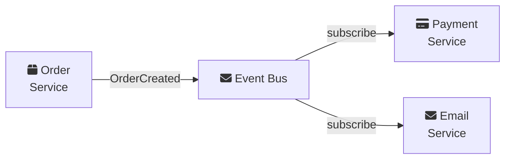

# Service Communication

Microservices communicate over the network using various protocols and patterns. Choosing the right communication style impacts your system's reliability, performance, and complexity.

---

## Section 1: Sync vs Async Communication

<ServiceCommunicationDemo mode="intermediate" />

| Aspect | Synchronous | Asynchronous |
| :--- | :--- | :--- |
| **Behavior** | Caller waits for response | Caller continues immediately |
| **Coupling** | Temporal (both must be up) | Loose (decoupled) |
| **Complexity** | Lower | Higher |
| **Use Case** | Real-time queries | Background processing |

<ProgressCheckpoint section="sc-sync-vs-async" xpReward={15} />

---

## Section 2: Communication Patterns

### HTTP REST

The most common approach for service-to-service communication:

```csharp
public class PaymentClient
{
    private readonly HttpClient _httpClient;

    public async Task<PaymentResult> ProcessPaymentAsync(PaymentRequest request)
    {
        var response = await _httpClient.PostAsJsonAsync("api/payments", request);
        response.EnsureSuccessStatusCode();
        return await response.Content.ReadFromJsonAsync<PaymentResult>();
    }
}
```

### gRPC

High-performance RPC framework using Protocol Buffers:

```protobuf
syntax = "proto3";

service PaymentService {
  rpc ProcessPayment (PaymentRequest) returns (PaymentResponse);
}

message PaymentRequest {
  string order_id = 1;
  double amount = 2;
  string currency = 3;
}
```

```csharp
var response = await _paymentClient.ProcessPaymentAsync(new PaymentRequest
{
    OrderId = orderId,
    Amount = 99.99,
    Currency = "USD"
});
```

### Message Queues (RabbitMQ)

Services communicate through a message broker:

```csharp
// Publisher (OrderService)
public class OrderCreatedPublisher
{
    private readonly IModel _channel;

    public void PublishOrderCreated(Order order)
    {
        var message = JsonSerializer.Serialize(new OrderCreatedEvent
        {
            OrderId = order.Id,
            CustomerId = order.CustomerId,
            TotalAmount = order.Total
        });

        var body = Encoding.UTF8.GetBytes(message);
        _channel.BasicPublish(exchange: "orders", routingKey: "order.created", body: body);
    }
}
```

### Comparison Table

| Aspect | HTTP REST | gRPC | Message Queue |
| :--- | :--- | :--- | :--- |
| **Type** | Synchronous | Synchronous | Asynchronous |
| **Format** | JSON/XML | Protocol Buffers | Any |
| **Speed** | Moderate | Fast | Depends |
| **Coupling** | Temporal | Temporal | Loose |
| **Use Case** | CRUD APIs | Service-to-Service | Background Jobs |

<ProgressCheckpoint section="sc-communication-patterns" xpReward={20} />

---

## Section 3: Implementation Patterns

### Retry with Exponential Backoff

```csharp
services.AddHttpClient<IPaymentClient, PaymentClient>()
    .AddTransientHttpErrorPolicy(policy => 
        policy.WaitAndRetryAsync(3, attempt => 
            TimeSpan.FromSeconds(Math.Pow(2, attempt))
        )
    );
```

### Circuit Breaker Pattern

Prevent cascading failures:

```csharp
services.AddHttpClient<IPaymentClient, PaymentClient>()
    .AddTransientHttpErrorPolicy(policy =>
        policy.CircuitBreakerAsync(
            handledEventsAllowedBeforeBreaking: 5,
            durationOfBreak: TimeSpan.FromSeconds(30)
        )
    );
```

### Event-Driven Architecture



### Key Takeaways

- **HTTP REST** - Simple, universal, good for most cases
- **gRPC** - High performance, strongly typed, for internal services
- **Message Queues** - Loose coupling, reliability, background processing
- Always implement **retries** and **circuit breakers**
- Choose based on latency requirements and coupling tolerance

<ProgressCheckpoint section="sc-implementation" xpReward={15} />
