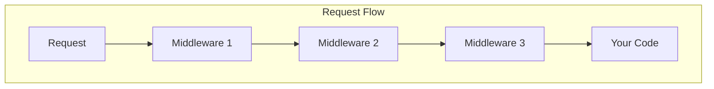
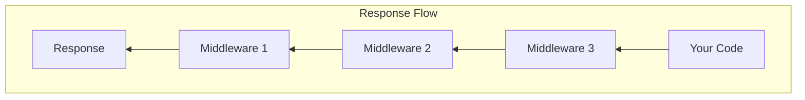

# Understanding the Request Pipeline

Imagine an **airport security line** . When you arrive, you don't go straight to your gate—you pass through multiple checkpoints first. Each checkpoint has a specific job: checking your ID, scanning your bag, inspecting your shoes.

**That's exactly how ASP.NET Core's Request Pipeline works!**

## Section 1: Pipeline Overview

### The Airport Analogy ️

| **Airport Checkpoint** | **Middleware Equivalent** |
| :--------------------- | :------------------------ |
|  Check your ticket | Exception Handler |
| 🆔 Verify your ID | Authentication |
|  Scan your bag | Authorization |
|  Check your shoes | Static Files |
|  Board the plane | Your App's Endpoint |

<InfoBox type="tip">
  **Key Insight:** Each piece of middleware is like a checkpoint. The request passes through each one in order, and then the response comes back through them in **reverse order**!
</InfoBox>

### Watch It In Action

<MiddlewarePipelineSimulator mode="beginner" />

### The Big Picture

Here's what happens when someone visits your website:

1.  **Request comes in** (like arriving at the airport)
2. ️ **Passes through middleware** (each checkpoint in order)
3.  **Reaches your code** (the endpoint/controller)
4. ⬅️ **Response travels back** (same checkpoints, reverse order)
5.  **Response sent to user** (you reach your destination!)

<ProgressCheckpoint section="pipeline-overview" xpReward={8} />

---

## Section 2: Pipeline Flow

### Two-Way Journey

The request goes IN through middleware, and the response comes OUT through the same middleware in reverse:





### Simple Example

```csharp
var builder = WebApplication.CreateBuilder(args);
var app = builder.Build();

// Middleware 1: Logging
app.Use(async (context, next) =>
{
    Console.WriteLine("→ Request coming in");
    await next();  // Call next middleware
    Console.WriteLine("← Response going out");
});

// Middleware 2: Your endpoint
app.MapGet("/", () => "Hello World!");

app.Run();
```

**Output when you visit `/`:**
```
→ Request coming in
← Response going out
```

<ProgressCheckpoint section="pipeline-flow" xpReward={8} />

---

## Section 3: Pipeline Order

### Why Does Order Matter?

Just like you can't board the plane before going through security, middleware order matters:

```csharp
// ❌ WRONG ORDER - Authorization before Authentication?
app.UseAuthorization();
app.UseAuthentication();  // Too late! Who are you?

// ✅ CORRECT ORDER
app.UseAuthentication();  // First: Who are you?
app.UseAuthorization();   // Then: What can you do?
```

<InfoBox type="warning">
  **Remember:** Authentication (who are you?) must come BEFORE Authorization (what can you do?). You can't check permissions for someone you haven't identified!
</InfoBox>

### Typical Middleware Order

```csharp
var app = builder.Build();

app.UseExceptionHandler("/Error");  // 1. Catch errors
app.UseHttpsRedirection();          // 2. Redirect to HTTPS
app.UseStaticFiles();               // 3. Serve static files
app.UseRouting();                   // 4. Match routes
app.UseAuthentication();            // 5. Who are you?
app.UseAuthorization();             // 6. What can you do?
app.MapControllers();               // 7. Run your code
```

### Key Takeaways

| Concept | Description |
| :------ | :---------- |
| ️ **Pipeline** | Requests pass through middleware in order |
| ↩️ **Two-Way** | Responses travel back through same middleware |
|  **Order Matters** | Put middleware in the right sequence |
|  **Each Has a Job** | One middleware = one responsibility |

<ProgressCheckpoint section="pipeline-order" xpReward={9} />
