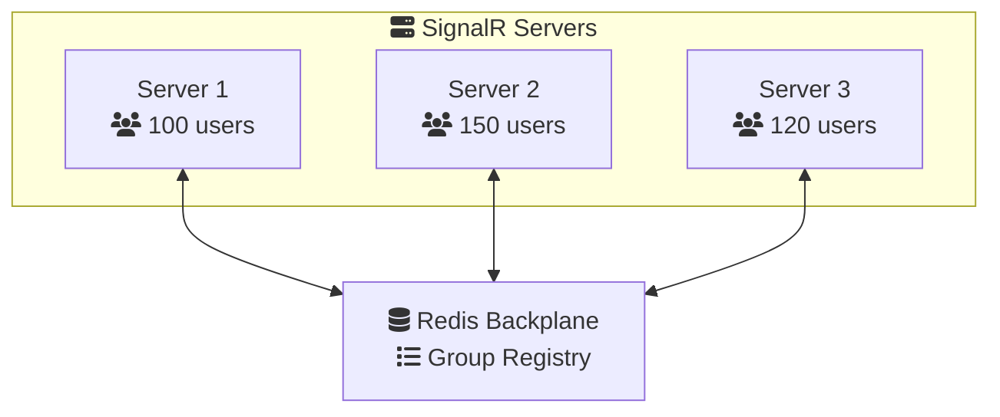

# Groups & Broadcasting: Enterprise-Scale Implementation

This advanced lesson covers distributed group management, custom backplanes, and production-scale broadcasting strategies.

## Distributed Group Management

In scaled-out environments with multiple servers, group management requires a distributed backplane to synchronize state across instances.

### Redis Backplane Implementation

```csharp
// Install: Microsoft.AspNetCore.SignalR.StackExchangeRedis

builder.Services.AddSignalR()
    .AddStackExchangeRedis(options =>
    {
        options.ConnectionFactory = async writer =>
        {
            var config = new ConfigurationOptions
            {
                AbortOnConnectFail = false,
                EndPoints = { { "redis-server", 6379 } },
                Password = configuration["Redis:Password"],
                Ssl = true,
                ConnectTimeout = 10000,
                SyncTimeout = 10000,
                AsyncTimeout = 10000,
                KeepAlive = 60,
                DefaultDatabase = 0
            };
            
            var connection = await ConnectionMultiplexer.ConnectAsync(config, writer);
            connection.ConnectionFailed += (_, e) =>
            {
                Console.WriteLine($"Redis connection failed: {e.Exception}");
            };
            
            connection.ConnectionRestored += (_, e) =>
            {
                Console.WriteLine("Redis connection restored");
            };
            
            return connection;
        };
    });
```

**Scale-Out Architecture:**



### Custom Backplane Implementation

```csharp
public class CustomGroupBackplane : HubLifetimeManager<Hub>
{
    private readonly IDistributedCache _cache;
    private readonly IMessageBus _messageBus;
    private readonly ILogger _logger;
    private readonly ConcurrentDictionary<string, HashSet<string>> _localGroups = new();
    
    public CustomGroupBackplane(
        IDistributedCache cache,
        IMessageBus messageBus,
        ILogger<CustomGroupBackplane> logger)
    {
        _cache = cache;
        _messageBus = messageBus;
        _logger = logger;
        
        // Subscribe to group changes from other servers
        _messageBus.Subscribe<GroupChangeMessage>(HandleGroupChange);
    }
    
    public override async Task AddToGroupAsync(
        string connectionId,
        string groupName,
        CancellationToken cancellationToken = default)
    {
        // Add to local cache
        _localGroups.AddOrUpdate(groupName,
            _ => new HashSet<string> { connectionId },
            (_, set) => { set.Add(connectionId); return set; });
        
        // Persist to distributed cache
        var key = $"group:{groupName}";
        var members = await GetGroupMembersAsync(groupName);
        members.Add(connectionId);
        await _cache.SetStringAsync(
            key, 
            JsonSerializer.Serialize(members),
            cancellationToken);
        
        // Notify other servers
        await _messageBus.PublishAsync(new GroupChangeMessage
        {
            GroupName = groupName,
            ConnectionId = connectionId,
            Action = GroupAction.Add
        });
        
        _logger.LogDebug(
            "Connection {ConnectionId} added to group {GroupName}",
            connectionId, groupName);
    }
    
    public override async Task RemoveFromGroupAsync(
        string connectionId,
        string groupName,
        CancellationToken cancellationToken = default)
    {
        // Remove from local cache
        if (_localGroups.TryGetValue(groupName, out var set))
        {
            set.Remove(connectionId);
        }
        
        // Update distributed cache
        var key = $"group:{groupName}";
        var members = await GetGroupMembersAsync(groupName);
        members.Remove(connectionId);
        
        if (members.Any())
        {
            await _cache.SetStringAsync(
                key,
                JsonSerializer.Serialize(members),
                cancellationToken);
        }
        else
        {
            await _cache.RemoveAsync(key, cancellationToken);
        }
        
        // Notify other servers
        await _messageBus.PublishAsync(new GroupChangeMessage
        {
            GroupName = groupName,
            ConnectionId = connectionId,
            Action = GroupAction.Remove
        });
    }
    
    public override async Task SendGroupAsync(
        string groupName,
        string method,
        object?[] args,
        CancellationToken cancellationToken = default)
    {
        var members = await GetGroupMembersAsync(groupName);
        
        foreach (var connectionId in members)
        {
            await SendConnectionAsync(connectionId, method, args, cancellationToken);
        }
    }
    
    private async Task<HashSet<string>> GetGroupMembersAsync(string groupName)
    {
        var key = $"group:{groupName}";
        var json = await _cache.GetStringAsync(key);
        
        return json == null 
            ? new HashSet<string>() 
            : JsonSerializer.Deserialize<HashSet<string>>(json) ?? new HashSet<string>();
    }
    
    private async Task HandleGroupChange(GroupChangeMessage message)
    {
        // Update local cache based on changes from other servers
        if (message.Action == GroupAction.Add)
        {
            _localGroups.AddOrUpdate(message.GroupName,
                _ => new HashSet<string> { message.ConnectionId },
                (_, set) => { set.Add(message.ConnectionId); return set; });
        }
        else if (message.Action == GroupAction.Remove)
        {
            if (_localGroups.TryGetValue(message.GroupName, out var set))
            {
                set.Remove(message.ConnectionId);
            }
        }
    }
}
```

<ProgressCheckpoint section="understanding-groups" xpReward={25} />

## Advanced Broadcasting Strategies

### Geo-Distributed Broadcasting

```csharp
public class GeoDistributedHub : Hub
{
    private readonly IGeoLocationService _geoService;
    
    public async Task BroadcastByRegion(string region, string message)
    {
        // Get all groups for this region
        var regionGroups = await GetRegionGroupsAsync(region);
        
        await Clients.Groups(regionGroups)
            .SendAsync("RegionalBroadcast", message);
    }
    
    public async Task BroadcastNearby(double latitude, double longitude, double radiusKm)
    {
        // Get connections within radius
        var nearbyConnections = await _geoService
            .GetConnectionsWithinRadiusAsync(latitude, longitude, radiusKm);
        
        await Clients.Clients(nearbyConnections)
            .SendAsync("NearbyBroadcast", "Message from nearby");
    }
    
    public override async Task OnConnectedAsync()
    {
        // Auto-assign to geo groups
        var location = await _geoService.GetConnectionLocationAsync(Context.ConnectionId);
        
        await Groups.AddToGroupAsync(Context.ConnectionId, $"country:{location.Country}");
        await Groups.AddToGroupAsync(Context.ConnectionId, $"region:{location.Region}");
        await Groups.AddToGroupAsync(Context.ConnectionId, $"city:{location.City}");
        
        await base.OnConnectedAsync();
    }
}
```

### Priority-Based Broadcasting

```csharp
public class PriorityBroadcastHub : Hub
{
    public async Task BroadcastWithPriority(
        string groupName,
        string message,
        BroadcastPriority priority)
    {
        switch (priority)
        {
            case BroadcastPriority.Critical:
                // Send immediately, bypass queues
                await SendCriticalMessageAsync(groupName, message);
                break;
            
            case BroadcastPriority.High:
                // Use high-priority queue
                await _priorityQueue.EnqueueHighAsync(groupName, message);
                break;
            
            case BroadcastPriority.Normal:
                // Use normal queue with batching
                await _priorityQueue.EnqueueNormalAsync(groupName, message);
                break;
            
            case BroadcastPriority.Low:
                // Defer and batch
                await _priorityQueue.EnqueueLowAsync(groupName, message);
                break;
        }
    }
    
    private async Task SendCriticalMessageAsync(string groupName, string message)
    {
        await Clients.Group(groupName)
            .SendAsync("CriticalMessage", new
            {
                Message = message,
                Priority = "CRITICAL",
                Timestamp = DateTime.UtcNow
            });
    }
}
```

### Partitioned Groups

```csharp
public class PartitionedGroupHub : Hub
{
    private const int PartitionCount = 10;
    
    public async Task JoinPartitionedRoom(string roomId)
    {
        // Distribute users across partitions
        var partition = GetPartition(Context.ConnectionId);
        var partitionedGroup = $"{roomId}:partition:{partition}";
        
        await Groups.AddToGroupAsync(Context.ConnectionId, partitionedGroup);
        await Groups.AddToGroupAsync(Context.ConnectionId, $"{roomId}:all");
    }
    
    public async Task BroadcastToRoom(string roomId, string message)
    {
        // Broadcast to all partitions
        var tasks = Enumerable.Range(0, PartitionCount)
            .Select(partition => 
                Clients.Group($"{roomId}:partition:{partition}")
                    .SendAsync("RoomMessage", message));
        
        await Task.WhenAll(tasks);
    }
    
    private int GetPartition(string connectionId)
    {
        // Consistent hashing
        return Math.Abs(connectionId.GetHashCode()) % PartitionCount;
    }
}
```

<ProgressCheckpoint section="group-management" xpReward={25} />

## Performance Monitoring & Optimization

### Group Metrics Collection

```csharp
public class MonitoredGroupHub : Hub
{
    private static readonly Histogram GroupSize = Metrics.CreateHistogram(
        "signalr_group_size",
        "Distribution of group sizes");
    
    private static readonly Counter GroupJoins = Metrics.CreateCounter(
        "signalr_group_joins_total",
        "Total group joins");
    
    private static readonly Counter GroupBroadcasts = Metrics.CreateCounter(
        "signalr_group_broadcasts_total",
        "Total group broadcasts");
    
    public async Task JoinRoom(string roomId)
    {
        await Groups.AddToGroupAsync(Context.ConnectionId, roomId);
        
        var size = await GetGroupSizeAsync(roomId);
        GroupSize.Observe(size);
        GroupJoins.Inc();
    }
    
    public async Task BroadcastToRoom(string roomId, string message)
    {
        var sw = Stopwatch.StartNew();
        
        await Clients.Group(roomId).SendAsync("RoomMessage", message);
        
        sw.Stop();
        GroupBroadcasts.Inc();
        
        _logger.LogInformation(
            "Broadcast to {RoomId} took {ElapsedMs}ms",
            roomId, sw.ElapsedMilliseconds);
    }
}
```

### Optimized Group Lookups

```csharp
public class CachedGroupHub : Hub
{
    private readonly IDistributedCache _cache;
    private static readonly TimeSpan CacheDuration = TimeSpan.FromMinutes(5);
    
    public async Task<List<string>> GetGroupMembers(string groupName)
    {
        var cacheKey = $"group:members:{groupName}";
        var cached = await _cache.GetStringAsync(cacheKey);
        
        if (cached != null)
        {
            return JsonSerializer.Deserialize<List<string>>(cached) 
                ?? new List<string>();
        }
        
        // Fetch from source
        var members = await FetchGroupMembersAsync(groupName);
        
        // Cache result
        await _cache.SetStringAsync(
            cacheKey,
            JsonSerializer.Serialize(members),
            new DistributedCacheEntryOptions
            {
                AbsoluteExpirationRelativeToNow = CacheDuration
            });
        
        return members;
    }
    
    public override async Task OnConnectedAsync()
    {
        await base.OnConnectedAsync();
        
        // Invalidate caches for groups this user joins
        await InvalidateGroupCachesAsync(Context.UserIdentifier);
    }
}
```

<ProgressCheckpoint section="broadcasting-patterns" xpReward={25} />

## Advanced Patterns

### Event Sourcing for Groups

```csharp
public class EventSourcedGroupHub : Hub
{
    private readonly IEventStore _eventStore;
    
    public async Task JoinRoom(string roomId)
    {
        var @event = new GroupJoinedEvent
        {
            RoomId = roomId,
            ConnectionId = Context.ConnectionId,
            UserId = Context.UserIdentifier,
            Timestamp = DateTime.UtcNow
        };
        
        await _eventStore.AppendAsync(@event);
        await Groups.AddToGroupAsync(Context.ConnectionId, roomId);
        
        // Replay history for new member
        var history = await _eventStore.GetRoomHistoryAsync(roomId);
        await Clients.Caller.SendAsync("RoomHistory", history);
    }
    
    public async Task<List<GroupJoinedEvent>> ReplayGroupHistory(string roomId)
    {
        return await _eventStore.GetRoomHistoryAsync(roomId);
    }
}
```

### CQRS Pattern

```csharp
public class CQRSGroupHub : Hub
{
    private readonly ICommandHandler _commandHandler;
    private readonly IQueryHandler _queryHandler;
    
    // Command: Mutate state
    public async Task JoinRoom(string roomId)
    {
        await _commandHandler.HandleAsync(new JoinRoomCommand
        {
            RoomId = roomId,
            ConnectionId = Context.ConnectionId,
            UserId = Context.UserIdentifier
        });
        
        await Groups.AddToGroupAsync(Context.ConnectionId, roomId);
    }
    
    // Query: Read state
    public async Task<RoomStatus> GetRoomStatus(string roomId)
    {
        return await _queryHandler.HandleAsync(new GetRoomStatusQuery
        {
            RoomId = roomId
        });
    }
}
```

## Production Best Practices

✅ **Implement distributed backplane** for multi-server deployments  
✅ **Use partitioned groups** for very large groups (10,000+ members)  
✅ **Monitor group sizes** and implement limits  
✅ **Cache group membership** queries  
✅ **Implement priority queues** for critical messages  
✅ **Use geo-distribution** for global applications  
✅ **Track group events** for analytics and debugging  
✅ **Implement graceful degradation** when backplane is unavailable  
✅ **Use event sourcing** for audit trails  
✅ **Apply CQRS** for complex group management  

## Scaling Benchmarks

| Scenario | Single Server | Redis Backplane (3 servers) |
|:---------|:--------------|:----------------------------|
| 10K connections | ✅ 50ms latency | ✅ 75ms latency |
| 100K connections | ❌ Not feasible | ✅ 100ms latency |
| 1M group broadcasts/sec | ❌ Not feasible | ✅ With partitioning |

> **Enterprise Ready**: With these advanced patterns, your SignalR groups can scale to millions of concurrent users across global infrastructure.
