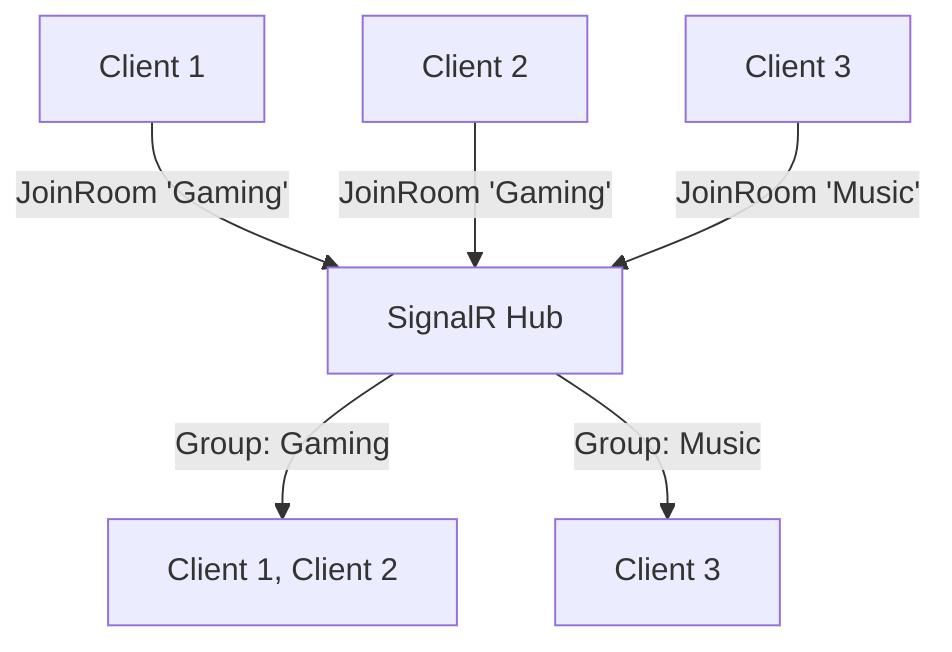

# Groups & Broadcasting: Organize Your Audience

Imagine a **school** with different classrooms. Instead of shouting to the entire school, teachers can talk to just ONE classroom! That's what **Groups** do in SignalR.

## What are Groups?

**Groups** are like **club memberships** or **chat rooms**. You can organize clients into groups and send messages only to those groups.

### Real-World Examples:

- **WhatsApp Groups** - Only members see messages
- **Game Lobbies** - Players in same match  
- **Slack Channels** - Team-specific conversations
- **Live Sports Rooms** - Fans of specific teams

<InfoBox type="success" title="The Classroom Analogy">
**Without Groups:**
- Teacher shouts to ENTIRE school: "Math homework due tomorrow!"
- Everyone hears it, even students not in math class

**With Groups:**
- Teacher talks to "Math Class" group only
- Only math students hear the announcement
- Much more efficient!
</InfoBox>

```csharp
public class ChatHub : Hub
{
    // Join a group (like entering a classroom)
    public async Task JoinRoom(string roomName)
    {
        await Groups.AddToGroupAsync(Context.ConnectionId, roomName);
        await Clients.Group(roomName).SendAsync("UserJoined", 
            $"Someone joined {roomName}!");
    }
    
    // Leave a group (like leaving a classroom)
    public async Task LeaveRoom(string roomName)
    {
        await Groups.RemoveFromGroupAsync(Context.ConnectionId, roomName);
        await Clients.Group(roomName).SendAsync("UserLeft", 
            $"Someone left {roomName}");
    }
}
```

<ProgressCheckpoint section="understanding-groups" xpReward={10} />

## Managing Groups

### Joining a Group

```csharp
public class ChatHub : Hub
{
    public async Task JoinChatRoom(string roomName)
    {
        // Add this connection to the group
        await Groups.AddToGroupAsync(Context.ConnectionId, roomName);
        
        // Welcome the new member
        await Clients.Caller.SendAsync("JoinedRoom", 
            $"Welcome to {roomName}!");
        
        // Notify others in the room
        await Clients.OthersInGroup(roomName).SendAsync("UserJoined",
            $"A new user joined {roomName}");
    }
}
```

**What happens:**
1. Connection ID joins the group (like getting a membership card)
2. Now they can receive group messages
3. They stay in the group until they leave or disconnect

### Leaving a Group

```csharp
public async Task LeaveChatRoom(string roomName)
{
    // Remove from group
    await Groups.RemoveFromGroupAsync(Context.ConnectionId, roomName);
    
    // Say goodbye
    await Clients.Group(roomName).SendAsync("UserLeft",
        "A user left the room");
}
```

### Automatic Cleanup

```csharp
public override async Task OnDisconnectedAsync(Exception? exception)
{
    // SignalR AUTOMATICALLY removes the connection from ALL groups!
    // You don't have to manually clean up
    await base.OnDisconnectedAsync(exception);
}
```

<KeyConcept title="Group Membership">
- Groups are **stored in memory** on the server
- When you disconnect, you're **automatically removed** from all groups
- Group names are **case-sensitive**: "room1" ≠ "Room1"
- A connection can be in **multiple groups** at once
</KeyConcept>

<ProgressCheckpoint section="group-management" xpReward={10} />

## Broadcasting to Groups

Now the fun part - sending messages to specific groups!

### Basic Broadcasting

```csharp
public class ChatHub : Hub
{
    public async Task SendToRoom(string roomName, string message)
    {
        // Send to EVERYONE in this room
        await Clients.Group(roomName).SendAsync("ReceiveMessage", message);
    }
}
```

### Broadcasting to Multiple Groups

```csharp
public async Task SendToMultipleRooms(List<string> rooms, string message)
{
    // Send to people in ANY of these rooms
    await Clients.Groups(rooms).SendAsync("ReceiveMessage", message);
}
```

### Excluding Specific Clients

```csharp
public async Task SendToGroupExceptMe(string roomName, string message)
{
    // Everyone in the room EXCEPT the caller
    await Clients.OthersInGroup(roomName).SendAsync("ReceiveMessage", message);
}

public async Task SendToGroupExceptSpecific(
    string roomName, 
    List<string> excludeIds, 
    string message)
{
    // Everyone EXCEPT specific connection IDs
    await Clients.GroupExcept(roomName, excludeIds)
        .SendAsync("ReceiveMessage", message);
}
```

## Complete Chat Room Example

**Server:**
```csharp
public class ChatHub : Hub
{
    public async Task JoinRoom(string roomName, string username)
    {
        // Join the group
        await Groups.AddToGroupAsync(Context.ConnectionId, roomName);
        
        // Welcome message to user
        await Clients.Caller.SendAsync("SystemMessage", 
            $"You joined {roomName}");
        
        // Announce to others
        await Clients.OthersInGroup(roomName).SendAsync("SystemMessage",
            $"{username} joined the room");
    }
    
    public async Task SendMessageToRoom(string roomName, string username, string message)
    {
        // Broadcast to everyone in the room
        await Clients.Group(roomName).SendAsync("ReceiveMessage", 
            username, 
            message);
    }
    
    public async Task LeaveRoom(string roomName, string username)
    {
        // Leave the group
        await Groups.RemoveFromGroupAsync(Context.ConnectionId, roomName);
        
        // Announce departure
        await Clients.Group(roomName).SendAsync("SystemMessage",
            $"{username} left the room");
    }
}
```

**Client:**
```html
<select id="roomSelect">
    <option value="room1">General</option>
    <option value="room2">Gaming</option>
    <option value="room3">Music</option>
</select>
<button onclick="joinRoom()">Join Room</button>
<button onclick="leaveRoom()">Leave Room</button>

<div id="messages"></div>
<input id="messageInput" placeholder="Type a message..." />
<button onclick="sendMessage()">Send</button>

<script src="https://cdn.jsdelivr.net/npm/@microsoft/signalr@latest/dist/browser/signalr.min.js"></script>
<script>
    const connection = new signalR.HubConnectionBuilder()
        .withUrl("/chatHub")
        .build();
    
    let currentRoom = null;
    const username = "User" + Math.floor(Math.random() * 1000);
    
    // Listen for messages
    connection.on("ReceiveMessage", (user, message) => {
        const div = document.getElementById("messages");
        div.innerHTML += `<p><strong>${user}:</strong> ${message}</p>`;
    });
    
    // Listen for system messages
    connection.on("SystemMessage", (message) => {
        const div = document.getElementById("messages");
        div.innerHTML += `<p><em>${message}</em></p>`;
    });
    
    // Start connection
    connection.start();
    
    function joinRoom() {
        const room = document.getElementById("roomSelect").value;
        currentRoom = room;
        connection.invoke("JoinRoom", room, username);
    }
    
    function leaveRoom() {
        if (currentRoom) {
            connection.invoke("LeaveRoom", currentRoom, username);
            currentRoom = null;
        }
    }
    
    function sendMessage() {
        if (!currentRoom) {
            alert("Join a room first!");
            return;
        }
        
        const message = document.getElementById("messageInput").value;
        connection.invoke("SendMessageToRoom", currentRoom, username, message);
        document.getElementById("messageInput").value = "";
    }
</script>
```

## Visual Flow



<Comparison
  left={{
    title: "Clients.All",
    items: [
      "Everyone hears",
      "Like school intercom",
      "Use for global announcements"
    ]
  }}
  right={{
    title: "Clients.Group",
    items: [
      "Only group members hear",
      "Like classroom chat",
      "Use for targeted messages"
    ]
  }}
/>

<ProgressCheckpoint section="broadcasting-patterns" xpReward={10} />

## Key Takeaways

**Groups** = Organize clients like club memberships  
**AddToGroupAsync** = Join a group  
**RemoveFromGroupAsync** = Leave a group  
**Clients.Group(name)** = Send to all in group  
**Clients.OthersInGroup(name)** = Send to group except caller  
**Auto-cleanup** = Groups cleared on disconnect  
**Multiple groups** = One client can join many groups  

> **Remember**: Groups are like classrooms in a school. You can be in multiple classes, and teachers can talk to specific classes instead of the whole school!

You now know how to build complete chat rooms and targeted broadcasting!
