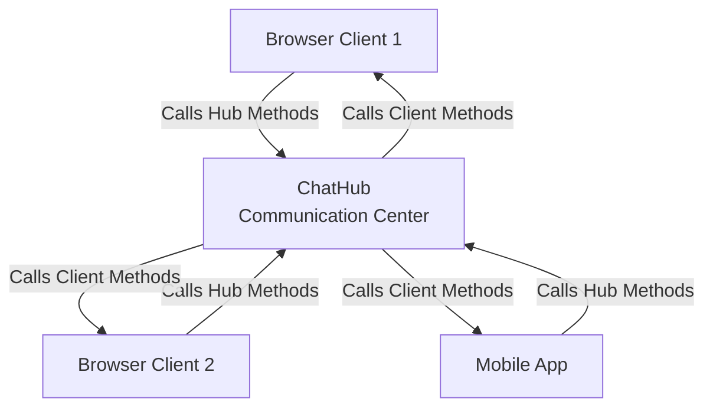

# Hubs & Clients: Your Real-Time Control Center

Imagine a **radio station** where the DJ (Hub) can talk to different listeners (Clients) in different ways:
- Broadcast to EVERYONE
- Call just ONE person
- Talk to a SPECIFIC group

That's exactly what SignalR Hubs do!

## What is a Hub?

A **Hub** is like a **central phone operator** that manages all communications between your server and clients.

```csharp
using Microsoft.AspNetCore.SignalR;

public class ChatHub : Hub
{
    // This is your "communication center"
    // Clients can call these methods
    // The Hub can call client methods
}
```

Think of it this way:



<InfoBox type="success" title="Real-World Analogy">
**Hub = School Announcements System**

- **Principal (Hub)** has a microphone
- Can announce to **ALL students** (Clients.All)
- Can call **ONE student** to the office (Clients.Client)
- Can talk to **specific class** (Clients.Group)

The students can also press the button to talk back to the principal!
</InfoBox>

<ProgressCheckpoint section="understanding-hubs" xpReward={10} />

## Talking to Clients

The Hub has a special property called `Clients` that lets you choose WHO to send messages to.

### 1. Talk to EVERYONE

```csharp
public class ChatHub : Hub
{
    public async Task SendToEveryone(string message)
    {
        // Like a loudspeaker announcement
        await Clients.All.SendAsync("ReceiveMessage", message);
    }
}
```

**Use Case**: Breaking news, system announcements

### 2. Talk to the CALLER only

```csharp
public async Task SendToMyself(string message)
{
    // Like talking to yourself in the mirror
    await Clients.Caller.SendAsync("ReceiveMessage", message);
}
```

**Use Case**: Confirmation messages, "You said: ..."

### 3. Talk to OTHERS (not the caller)

```csharp
public async Task SendToOthers(string message)
{
    // Everyone hears it except you
    await Clients.Others.SendAsync("ReceiveMessage", message);
}
```

**Use Case**: "John is typing...", multiplayer game movements

### 4. Talk to ONE specific person

```csharp
public async Task SendToSpecificPerson(string connectionId, string message)
{
    // Like calling someone's phone directly
    await Clients.Client(connectionId).SendAsync("ReceiveMessage", message);
}
```

**Use Case**: Private messages, direct notifications

<Comparison
  left={{
    title: "Clients.All",
    items: [
      "Everyone hears it",
      "Like a group chat",
      "Public announcements"
    ]
  }}
  right={{
    title: "Clients.Caller",
    items: [
      "Only you hear it",
      "Like a private reply",
      "Personal confirmations"
    ]
  }}
/>

<ProgressCheckpoint section="client-communication" xpReward={10} />

## Client-Side: Listening for Messages

On the client (browser), you **listen** for messages the Hub sends:

```javascript
const connection = new signalR.HubConnectionBuilder()
    .withUrl("/chatHub")
    .build();

// Set up your "radio receiver"
connection.on("ReceiveMessage", (message) => {
    console.log("Got a message:", message);
    // Update your UI here!
});

// Turn on the radio
connection.start();
```

### Full Example: Echo Bot

**Server (Hub):**
```csharp
public class EchoHub : Hub
{
    public async Task Echo(string message)
    {
        // Send it back to the caller
        await Clients.Caller.SendAsync("EchoResponse", $"You said: {message}");
    }
}
```

**Client (JavaScript):**
```javascript
// Listen for echo responses
connection.on("EchoResponse", (response) => {
    alert(response); // "You said: Hello!"
});

// Send a message
connection.invoke("Echo", "Hello!");
```

<InfoBox type="tip" title="Method Names Match!">
The name you use in `SendAsync("EchoResponse")` on the server must **match exactly** with `connection.on("EchoResponse")` on the client!

Think of it like tuning to the right radio station frequency
</InfoBox>

<ProgressCheckpoint section="connection-management" xpReward={10} />

## Connection Lifecycle

Every client has a **Connection ID** - like a phone number!

```csharp
public class NotificationHub : Hub
{
    public override async Task OnConnectedAsync()
    {
        // Someone just joined!
        string connectionId = Context.ConnectionId;
        
        await Clients.All.SendAsync("UserJoined", connectionId);
        await base.OnConnectedAsync();
    }
    
    public override async Task OnDisconnectedAsync(Exception? exception)
    {
        // Someone left
        string connectionId = Context.ConnectionId;
        
        await Clients.All.SendAsync("UserLeft", connectionId);
        await base.OnDisconnectedAsync(exception);
    }
}
```

**What happens:**

1. **User opens webpage** → `OnConnectedAsync()` fires
2. **User closes webpage** → `OnDisconnectedAsync()` fires
3. **Connection ID** is assigned automatically (like getting a phone number)

## Complete Chat Example

**Server:**
```csharp
public class ChatHub : Hub
{
    public async Task SendMessage(string user, string message)
    {
        // Broadcast to everyone
        await Clients.All.SendAsync("ReceiveMessage", user, message);
    }
    
    public override async Task OnConnectedAsync()
    {
        await Clients.All.SendAsync("SystemMessage", 
            $"User {Context.ConnectionId} joined the chat!");
        await base.OnConnectedAsync();
    }
}
```

**Client:**
```html
<div id="messages"></div>
<input id="userInput" placeholder="Your name" />
<input id="messageInput" placeholder="Message" />
<button onclick="sendMessage()">Send</button>

<script src="https://cdn.jsdelivr.net/npm/@microsoft/signalr@latest/dist/browser/signalr.min.js"></script>
<script>
    const connection = new signalR.HubConnectionBuilder()
        .withUrl("/chatHub")
        .build();
    
    // Listen for messages
    connection.on("ReceiveMessage", (user, message) => {
        const div = document.getElementById("messages");
        div.innerHTML += `<p><strong>${user}:</strong> ${message}</p>`;
    });
    
    // Listen for system messages
    connection.on("SystemMessage", (message) => {
        const div = document.getElementById("messages");
        div.innerHTML += `<p><em>${message}</em></p>`;
    });
    
    // Start connection
    connection.start().then(() => {
        console.log("Connected to chat!");
    });
    
    function sendMessage() {
        const user = document.getElementById("userInput").value;
        const message = document.getElementById("messageInput").value;
        
        connection.invoke("SendMessage", user, message);
    }
</script>
```

## Key Takeaways

**Hub** = Central communication center (like a phone operator)  
**Clients** property = Choose WHO receives messages  
**Clients.All** = Talk to everyone (broadcast)  
**Clients.Caller** = Reply to sender only  
**Clients.Client(id)** = Talk to specific person  
**Connection ID** = Unique identifier for each client  
**Method names must match** between server and client  

> **Remember**: The Hub is like a DJ at a radio station - it can broadcast to everyone, talk to specific callers, or send private messages!

Next up: Let's learn about **Groups** for organizing clients!
