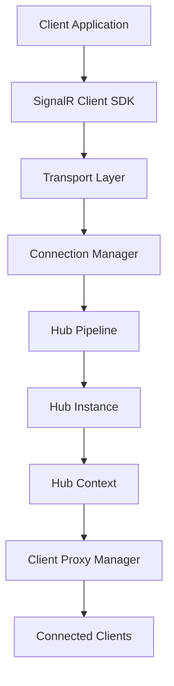
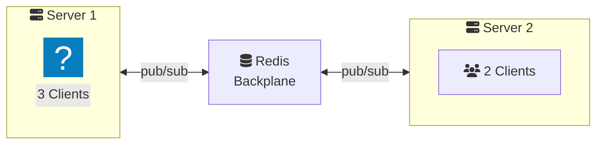

# SignalR Fundamentals: Architecture & Performance Optimization

This advanced lesson explores SignalR's internal architecture, transport mechanisms, protocol specifications, and production-grade optimization strategies.

## SignalR Architecture Overview

SignalR's architecture consists of multiple layers handling connection management, protocol negotiation, and message routing.



### Hub Pipeline Architecture

The Hub pipeline processes every hub method invocation through a series of filters and handlers.

```csharp
public class PerformanceMonitoringFilter : IHubFilter
{
    public async ValueTask<object?> InvokeMethodAsync(
        HubInvocationContext invocationContext,
        Func<HubInvocationContext, ValueTask<object?>> next)
    {
        var stopwatch = Stopwatch.StartNew();
        
        try
        {
            return await next(invocationContext);
        }
        finally
        {
            stopwatch.Stop();
            Console.WriteLine(
                $"Method {invocationContext.HubMethodName} " +
                $"completed in {stopwatch.ElapsedMilliseconds}ms");
        }
    }
}

// Register globally
builder.Services.AddSignalR(options =>
{
    options.AddFilter<PerformanceMonitoringFilter>();
});
```

### Connection Lifecycle Management

```csharp
public class AdvancedHub : Hub
{
    private readonly IConnectionTracker _connectionTracker;
    private readonly ILogger<AdvancedHub> _logger;
    
    public AdvancedHub(
        IConnectionTracker connectionTracker,
        ILogger<AdvancedHub> logger)
    {
        _connectionTracker = connectionTracker;
        _logger = logger;
    }
    
    public override async Task OnConnectedAsync()
    {
        var httpContext = Context.GetHttpContext();
        var userAgent = httpContext?.Request.Headers["User-Agent"].ToString();
        var transport = Context.Features.Get<IHttpTransportFeature>()?.TransportType;
        
        _logger.LogInformation(
            "Connection established: {ConnectionId}, Transport: {Transport}, UA: {UserAgent}",
            Context.ConnectionId, transport, userAgent);
        
        await _connectionTracker.AddConnectionAsync(
            Context.ConnectionId, 
            Context.UserIdentifier);
        
        await base.OnConnectedAsync();
    }
    
    public override async Task OnDisconnectedAsync(Exception? exception)
    {
        if (exception != null)
        {
            _logger.LogError(exception, 
                "Connection {ConnectionId} disconnected with error", 
                Context.ConnectionId);
        }
        
        await _connectionTracker.RemoveConnectionAsync(Context.ConnectionId);
        await base.OnDisconnectedAsync(exception);
    }
}
```

<ProgressCheckpoint section="what-is-signalr" xpReward={25} />

## Transport Protocol Deep Dive

### WebSocket Frame Structure

WebSocket frames follow RFC 6455 specification:

```
 0                   1                   2                   3
 0 1 2 3 4 5 6 7 8 9 0 1 2 3 4 5 6 7 8 9 0 1 2 3 4 5 6 7 8 9 0 1
+-+-+-+-+-------+-+-------------+-------------------------------+
|F|R|R|R| opcode|M| Payload len |    Extended payload length    |
|I|S|S|S|  (4)  |A|     (7)     |             (16/64)           |
|N|V|V|V|       |S|             |   (if payload len==126/127)   |
| |1|2|3|       |K|             |                               |
+-+-+-+-+-------+-+-------------+ - - - - - - - - - - - - - - - +
|     Extended payload length continued, if payload len == 127  |
+ - - - - - - - - - - - - - - - +-------------------------------+
|                               |Masking-key, if MASK set to 1  |
+-------------------------------+-------------------------------+
| Masking-key (continued)       |          Payload Data         |
+-------------------------------- - - - - - - - - - - - - - - - +
:                     Payload Data continued ...                :
+ - - - - - - - - - - - - - - - - - - - - - - - - - - - - - - - +
|                     Payload Data continued ...                |
+---------------------------------------------------------------+
```

### Custom Transport Implementation

```csharp
public class MetricsTransport : IHttpTransport
{
    private readonly IHttpTransport _innerTransport;
    private readonly IMetricsCollector _metrics;
    
    public async Task ProcessRequestAsync(
        HttpContext context, 
        CancellationToken token)
    {
        var startTime = DateTime.UtcNow;
        var bytesSent = 0L;
        var bytesReceived = 0L;
        
        try
        {
            // Wrap streams to track bytes
            var originalRequestBody = context.Request.Body;
            var originalResponseBody = context.Response.Body;
            
            context.Request.Body = new MetricsStream(
                originalRequestBody, 
                bytes => bytesReceived += bytes);
            
            context.Response.Body = new MetricsStream(
                originalResponseBody, 
                bytes => bytesSent += bytes);
            
            await _innerTransport.ProcessRequestAsync(context, token);
        }
        finally
        {
            var duration = DateTime.UtcNow - startTime;
            _metrics.RecordTransportMetrics(
                bytesSent, 
                bytesReceived, 
                duration);
        }
    }
}
```

### Protocol Negotiation Optimization

```csharp
builder.Services.AddSignalR(options =>
{
    // Disable transports for security/performance
    options.Transports = 
        HttpTransportType.WebSockets | 
        HttpTransportType.ServerSentEvents;
    
    // Custom negotiation timeout
    options.HandshakeTimeout = TimeSpan.FromSeconds(10);
});

app.MapHub<ChatHub>("/hub", options =>
{
    // Endpoint-specific configuration
    options.Transports = HttpTransportType.WebSockets;
    options.LongPolling.PollTimeout = TimeSpan.FromSeconds(90);
});
```

<ProgressCheckpoint section="transports-protocols" xpReward={25} />

## Production-Grade Configuration

### High-Performance Setup

```csharp
var builder = WebApplication.CreateBuilder(args);

builder.Services.AddSignalR(options =>
{
    // Performance tuning
    options.EnableDetailedErrors = false; // Production: disable
    options.KeepAliveInterval = TimeSpan.FromSeconds(10);
    options.ClientTimeoutInterval = TimeSpan.FromSeconds(20);
    options.HandshakeTimeout = TimeSpan.FromSeconds(15);
    options.MaximumReceiveMessageSize = 32 * 1024; // 32 KB
    options.StreamBufferCapacity = 10;
    options.MaximumParallelInvocationsPerClient = 1;
    
    // Compression
    options.SupportedProtocols = new List<string> 
    { 
        "json", 
        "messagepack" 
    };
})
.AddMessagePackProtocol(options =>
{
    options.SerializerOptions = MessagePackSerializerOptions.Standard
        .WithCompression(MessagePackCompression.Lz4Block)
        .WithSecurity(MessagePackSecurity.UntrustedData);
})
.AddStackExchangeRedis(connectionString, options =>
{
    // Redis backplane for scale-out
    options.Configuration.ChannelPrefix = "SignalR";
    options.Configuration.ConnectTimeout = 10000;
    options.Configuration.SyncTimeout = 10000;
});

var app = builder.Build();

// Use response compression for non-WebSocket transports
app.UseResponseCompression();

app.MapHub<ChatHub>("/hub", options =>
{
    options.ApplicationMaxBufferSize = 64 * 1024;
    options.TransportMaxBufferSize = 64 * 1024;
});
```

### Strongly-Typed Hubs

```csharp
// Define client interface
public interface IChatClient
{
    Task ReceiveMessage(string user, string message);
    Task UserJoined(string userId);
    Task UserLeft(string userId);
    Task TypingIndicator(string userId, bool isTyping);
}

// Strongly-typed hub
public class ChatHub : Hub<IChatClient>
{
    public async Task SendMessage(string message)
    {
        var user = Context.User?.Identity?.Name ?? "Anonymous";
        
        // Type-safe client calls
        await Clients.All.ReceiveMessage(user, message);
    }
    
    public async Task NotifyTyping(bool isTyping)
    {
        var userId = Context.UserIdentifier 
            ?? Context.ConnectionId;
        
        await Clients.Others.TypingIndicator(userId, isTyping);
    }
}
```

### Advanced Client Configuration

```typescript
const connection = new signalR.HubConnectionBuilder()
    .withUrl("/hub", {
        transport: signalR.HttpTransportType.WebSockets,
        accessTokenFactory: () => getAccessToken(),
        headers: {
            "X-Client-Version": "2.0.0"
        },
        withCredentials: true
    })
    .withAutomaticReconnect({
        nextRetryDelayInMilliseconds: retryContext => {
            // Exponential backoff: 0, 2, 10, 30 seconds, then 30s
            if (retryContext.previousRetryCount === 0) return 0;
            if (retryContext.previousRetryCount === 1) return 2000;
            if (retryContext.previousRetryCount === 2) return 10000;
            return 30000;
        }
    })
    .configureLogging(signalR.LogLevel.Warning)
    .withHubProtocol(new signalR.protocols.msgpack.MessagePackHubProtocol())
    .build();

// Connection state management
connection.onreconnecting(error => {
    console.warn("Reconnecting...", error);
    showReconnectingUI();
});

connection.onreconnected(connectionId => {
    console.log("Reconnected:", connectionId);
    hideReconnectingUI();
    resubscribeToGroups();
});

connection.onclose(error => {
    console.error("Connection closed:", error);
    showDisconnectedUI();
});
```

### Scaling with Redis Backplane

```csharp
// Install: Microsoft.AspNetCore.SignalR.StackExchangeRedis

builder.Services.AddSignalR()
    .AddStackExchangeRedis(options =>
    {
        options.Configuration.EndPoints.Add("redis-server", 6379);
        options.Configuration.Password = "your-redis-password";
        options.Configuration.Ssl = true;
        options.Configuration.AbortOnConnectFail = false;
        options.Configuration.ChannelPrefix = "MyApp.SignalR";
    });
```

**Architecture with Redis:**



### Message Compression Benchmarks

| Protocol | Message Size | Bandwidth | Latency |
|:---------|:-------------|:----------|:--------|
| JSON | 450 bytes | High | ~5ms |
| MessagePack | 180 bytes | 60% less | ~3ms |
| MessagePack + LZ4 | 120 bytes | 73% less | ~4ms |

```csharp
// Benchmark results for 1000 messages
// JSON:        450 KB, ~5 seconds
// MessagePack: 180 KB, ~3 seconds  (2.5x faster, 60% less bandwidth)
// MP + LZ4:    120 KB, ~4 seconds  (compression overhead for small messages)
```

<ProgressCheckpoint section="setup-configuration" xpReward={25} />

## Security Best Practices

### Authentication & Authorization

```csharp
using Microsoft.AspNetCore.Authorization;

[Authorize]
public class SecureHub : Hub
{
    [Authorize(Roles = "Admin")]
    public async Task BroadcastAnnouncement(string message)
    {
        await Clients.All.SendAsync("Announcement", message);
    }
    
    [Authorize(Policy = "PremiumUser")]
    public async Task SendPremiumMessage(string message)
    {
        await Clients.Group("Premium").SendAsync("ReceiveMessage", message);
    }
}

// JWT authentication
builder.Services.AddAuthentication(JwtBearerDefaults.AuthenticationScheme)
    .AddJwtBearer(options =>
    {
        options.Events = new JwtBearerEvents
        {
            OnMessageReceived = context =>
            {
                var accessToken = context.Request.Query["access_token"];
                var path = context.HttpContext.Request.Path;
                
                if (!string.IsNullOrEmpty(accessToken) && 
                    path.StartsWithSegments("/hub"))
                {
                    context.Token = accessToken;
                }
                
                return Task.CompletedTask;
            }
        };
    });
```

### CORS Configuration

```csharp
builder.Services.AddCors(options =>
{
    options.AddPolicy("SignalRPolicy", policy =>
    {
        policy.WithOrigins("https://myapp.com")
              .AllowAnyHeader()
              .AllowAnyMethod()
              .AllowCredentials();
    });
});

app.UseCors("SignalRPolicy");
```

## Monitoring & Diagnostics

### Health Checks

```csharp
builder.Services.AddHealthChecks()
    .AddSignalRHub("https://localhost:5001/hub", 
        name: "signalr-hub-check");

app.MapHealthChecks("/health");
```

### Application Insights Integration

```csharp
builder.Services.AddApplicationInsightsTelemetry();

builder.Services.AddSignalR()
    .AddApplicationInsightsTelemetry();
```

## Performance Optimization Checklist

 **Use WebSockets exclusively** in controlled environments  
 **Implement MessagePack protocol** for 60% bandwidth reduction  
 **Configure Redis backplane** for horizontal scaling  
 **Enable response compression** for SSE/Long Polling  
 **Set appropriate buffer sizes** based on message patterns  
 **Implement connection pooling** for .NET clients  
 **Monitor connection metrics** (count, duration, throughput)  
 **Use strongly-typed hubs** for compile-time safety  
 **Implement proper error handling** and retry policies  
 **Configure timeouts appropriately** for your use case  

## Advanced Patterns

### Request-Response Pattern

```csharp
public class QueryHub : Hub
{
    public async Task<UserData> GetUserData(string userId)
    {
        // Server can return values directly
        return await _userService.GetUserAsync(userId);
    }
}

// Client
const userData = await connection.invoke("GetUserData", "user123");
```

### Streaming

```csharp
public class StreamHub : Hub
{
    public async IAsyncEnumerable<int> StreamNumbers(
        int count,
        [EnumeratorCancellation] CancellationToken cancellationToken)
    {
        for (int i = 0; i < count; i++)
        {
            cancellationToken.ThrowIfCancellationRequested();
            yield return i;
            await Task.Delay(1000, cancellationToken);
        }
    }
}

// Client
connection.stream("StreamNumbers", 10)
    .subscribe({
        next: (value) => console.log(value),
        error: (err) => console.error(err),
        complete: () => console.log("Stream completed")
    });
```

> **Production Readiness**: With these advanced patterns and optimizations, your SignalR application is ready for production scale. Monitor performance metrics and adjust configurations based on real-world usage patterns.
