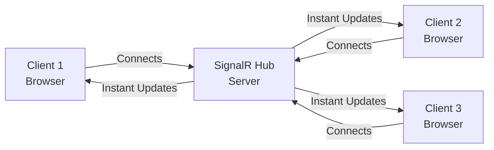

# SignalR Fundamentals: Real-Time Magic! 

Imagine you're watching a live sports game on TV. The score updates **instantly** when a goal is scored - you don't have to refresh your TV! That's exactly what **SignalR** does for web applications.

## What is SignalR?

**SignalR is like a phone call** between your server and clients, instead of sending letters (traditional HTTP requests).

### The Traditional Way vs SignalR

| Traditional HTTP (Letters ) | SignalR (Phone Call ) |
| :--- | :--- |
| Client asks: "Any updates?" every few seconds | Server calls client: "Hey! Here's an update!" |
| Slow and wasteful | Instant and efficient |
| Like checking your mailbox repeatedly | Like getting a notification |

<InfoBox type="success" title="Real-World Examples">
**Where you've seen SignalR in action:**
-  **Chat apps** (WhatsApp Web, Discord)
-  **Live dashboards** (stock prices, analytics)
-  **Multiplayer games** (real-time player movements)
-  **Notifications** (Facebook, Twitter)
-  **Live tracking** (Uber, food delivery apps)
</InfoBox>

## The Restaurant Analogy 

Think of SignalR like ordering pizza:

**Without SignalR (Traditional):**
- You call the restaurant every 5 minutes: "Is my pizza ready?"
- Annoying for both you and the restaurant!

**With SignalR:**
- Restaurant calls YOU when pizza is ready
- You can do other things while waiting
- Instant notification when it's done!

```csharp
// The magic of SignalR - Server notifies clients instantly!
public class PizzaHub : Hub
{
    public async Task PizzaReady(string orderId)
    {
        // Call ALL hungry customers waiting for this pizza
        await Clients.All.SendAsync("YourPizzaIsReady", orderId);
    }
}
```

<ProgressCheckpoint section="what-is-signalr" xpReward={10} />

## How Does SignalR Work? 

SignalR uses different **transports** (ways to communicate) based on what your browser supports:

### 1. WebSockets  (The Best!)
- **Like a dedicated phone line** - always connected
- Super fast, two-way communication
- Works in modern browsers

### 2. Server-Sent Events  (The Backup)
- **Like a radio broadcast** - server sends, client listens
- One-way (server → client only)
- Older browser support

### 3. Long Polling ⏱️ (The Fallback)
- **Like checking your mailbox** but waiting there
- Client asks, keeps connection open until data arrives
- Works everywhere, but slower

```csharp
// SignalR automatically picks the best transport for you!
// You don't have to worry about it 🎉
```

<KeyConcept title="SignalR Transports">
SignalR is smart! It automatically chooses the **best** transport method:
1. Tries **WebSockets** first (fastest)
2. Falls back to **Server-Sent Events** if needed
3. Uses **Long Polling** as last resort

You get real-time communication without worrying about browser compatibility!
</KeyConcept>

<ProgressCheckpoint section="transports-protocols" xpReward={10} />

## Setting Up SignalR ️

Let's create your first SignalR app! It's easier than ordering that pizza.

### Step 1: Install SignalR (Already included in ASP.NET Core!)

```bash
# SignalR comes built-in with ASP.NET Core
# No extra packages needed! 🎉
```

### Step 2: Create a Hub (Your Communication Center)

```csharp
using Microsoft.AspNetCore.SignalR;

// This is your "phone operator" - handles all calls
public class ChatHub : Hub
{
    public async Task SendMessage(string user, string message)
    {
        // Broadcast to EVERYONE connected
        await Clients.All.SendAsync("ReceiveMessage", user, message);
    }
}
```

### Step 3: Register SignalR in Program.cs

```csharp
var builder = WebApplication.CreateBuilder(args);

// Add SignalR service
builder.Services.AddSignalR();

var app = builder.Build();

// Map your hub to a route (like /chatHub)
app.MapHub<ChatHub>("/chatHub");

app.Run();
```

### Step 4: Connect from JavaScript

```javascript
// Connect to the hub
const connection = new signalR.HubConnectionBuilder()
    .withUrl("/chatHub")
    .build();

// Listen for messages
connection.on("ReceiveMessage", (user, message) => {
    console.log(`${user}: ${message}`);
});

// Start the connection
connection.start();
```

<InfoBox type="tip" title="That's It!">
You now have a **real-time chat app** in just a few lines of code! 

When the server calls `Clients.All.SendAsync()`, **all connected browsers** receive the message instantly!
</InfoBox>

## Visual Flow



<ProgressCheckpoint section="setup-configuration" xpReward={10} />

## Key Takeaways 

 **SignalR enables real-time communication** - server pushes updates to clients instantly  
 **Automatic transport selection** - works on all browsers without extra code  
 **Easy to set up** - just a few lines to get started  
 **Perfect for chat, dashboards, notifications** and any live updates  

> **Remember**: SignalR is like having a phone call instead of sending letters. Your server can notify clients the moment something happens! 

Ready to dive deeper? Let's learn about Hubs and Clients next! 
