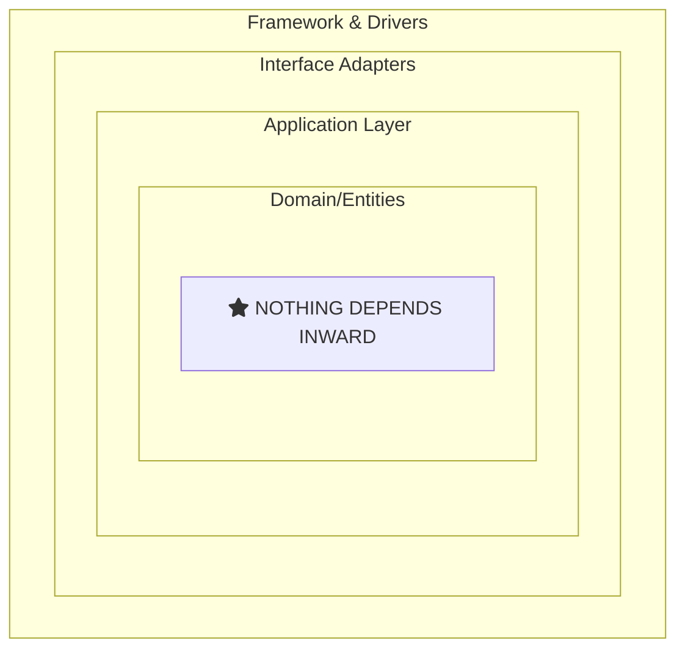

# Dependency Inversion Principle (DIP) — Advanced

At the advanced level, we explore DIP through **Clean Architecture**, **composition roots**, **advanced DI patterns**, and the relationship between DIP and other architectural principles.

---

## Section 1: Clean Architecture and DIP

Clean Architecture (Robert C. Martin) is built entirely on DIP:



Dependencies flow INWARD. Inner layers NEVER know about outer layers.

<InfoBox type="important">
**Core Insight:** The domain (innermost layer) defines interfaces. Infrastructure implements them. The domain doesn't know about SQL, HTTP, or any framework.
</InfoBox>

<ProgressCheckpoint section="dip-introduction" xpReward={20} />

---

## Section 2: Composition Root Pattern

All dependency wiring should happen at the **composition root** - the application entry point:

```csharp
// Program.cs - The Composition Root
var builder = WebApplication.CreateBuilder(args);

// Infrastructure registrations
builder.Services.AddDbContext<AppDbContext>(options =>
    options.UseSqlServer(builder.Configuration.GetConnectionString("Default")));

// Repository registrations
builder.Services.AddScoped<IOrderRepository, EfOrderRepository>();
builder.Services.AddScoped<ICustomerRepository, EfCustomerRepository>();

// External service registrations
builder.Services.AddScoped<IEmailService, SendGridEmailService>();
builder.Services.AddScoped<IPaymentGateway, StripePaymentGateway>();

// Application service registrations
builder.Services.AddScoped<IOrderService, OrderService>();

// Beyond this point, NO direct instantiation of implementations!
```

<SolidPrincipleDemo principle="D" mode="advanced" />

<ProgressCheckpoint section="dip-understanding" xpReward={20} />

---

## Section 3: Advanced DI Patterns

### Factory Pattern for Runtime Decisions

```csharp
public interface IPaymentProcessorFactory
{
    IPaymentProcessor CreateProcessor(PaymentMethod method);
}

public class PaymentProcessorFactory : IPaymentProcessorFactory
{
    private readonly IServiceProvider _provider;
    
    public IPaymentProcessor CreateProcessor(PaymentMethod method)
    {
        return method switch
        {
            PaymentMethod.CreditCard => _provider.GetRequiredService<CreditCardProcessor>(),
            PaymentMethod.PayPal => _provider.GetRequiredService<PayPalProcessor>(),
            _ => throw new ArgumentOutOfRangeException(nameof(method))
        };
    }
}
```

### Decorator Pattern with DI

```csharp
// Base implementation
public class OrderRepository : IOrderRepository { /* ... */ }

// Caching decorator
public class CachingOrderRepository : IOrderRepository
{
    private readonly IOrderRepository _inner;
    private readonly ICacheService _cache;
    
    public Order GetById(int id)
    {
        return _cache.GetOrSet($"order:{id}", 
            () => _inner.GetById(id), 
            TimeSpan.FromMinutes(5));
    }
}
```

### Key Takeaways

<InfoBox type="tip" title="Remember">
- 🏛️ **Clean Architecture** is built on DIP
- 🎯 **Composition Root** is the single wiring location
- 🏭 **Factory Pattern** for runtime dependency creation
- 🎀 **Decorator Pattern** for cross-cutting concerns
- ⚠️ **Avoid captive dependencies** and temporal coupling
</InfoBox>

<ProgressCheckpoint section="dip-application" xpReward={20} />
