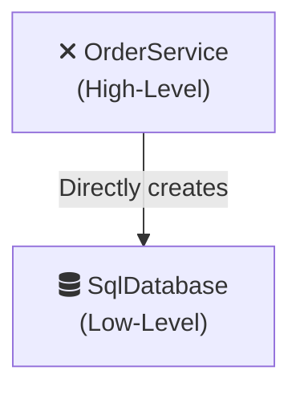
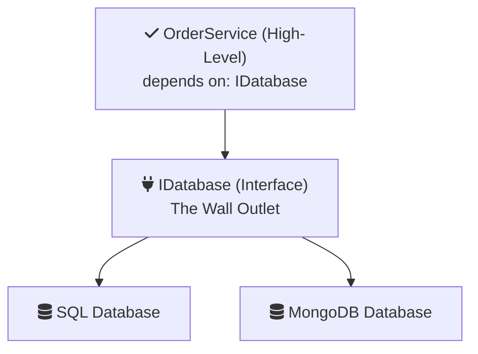

# Dependency Inversion Principle (DIP)

Imagine buying a new lamp. Would you prefer to:

A) Wire it directly into your house's electrical system? 🔌⚡
B) Just plug it into a wall outlet? 🔌✨

Obviously B! That's the **Dependency Inversion Principle** in action.

---

## Section 1: The Wall Outlet Analogy 🔌

| **Direct Wiring** ⚡ | **Using an Outlet** 🔌 |
|:---------------------|:----------------------|
| Need an electrician | Anyone can do it |
| Permanent connection | Easy to unplug |
| One lamp per wire | Any device with a plug |
| Changing lamps = rewiring | Just swap devices |

Wall outlets are **standardized interfaces**. Any device with a standard plug can use any outlet. Your lamp doesn't care if the power comes from a coal plant or solar panels!

<InfoBox type="tip">
**The DIP Says:** Don't connect your code directly to specific implementations. Use "outlets" (interfaces) so you can easily swap things out!
</InfoBox>

<ProgressCheckpoint section="dip-introduction" xpReward={8} />

---

## Section 2: The Problem - Tight Coupling

When your code directly creates and uses specific classes, it's "hardwired":

<SolidPrincipleDemo principle="D" mode="beginner" />

### Direct Connection = Problems

**Problems:**
- ❌ Can't test OrderService without a real database!
- ❌ Want to use MongoDB? Rewrite OrderService!
- ❌ OrderService "knows too much" about database details

<ProgressCheckpoint section="dip-understanding" xpReward={9} />

---

## Section 3: The Solution - Program to an Interface

     
Now you can swap databases without touching OrderService!

### The Simple Rule

> **"High-level modules should not depend on low-level modules. Both should depend on abstractions."**
> — Robert C. Martin

### Key Takeaways

<InfoBox type="tip" title="Remember">
- 🔌 **Use "outlets" (interfaces)** - Don't hardwire your code
- 📦 **Depend on abstractions** - Not specific implementations
- 🔄 **Swappable parts** - Like changing a tire without redesigning the car
- 🧪 **Enables testing** - Use fake implementations in tests
</InfoBox>

<ProgressCheckpoint section="dip-application" xpReward={8} />
