# Interface Segregation Principle (ISP)

Have you ever used a TV remote with 100 buttons, when you only use 5 of them? Volume up, volume down, channel change, mute, and power. That's it! 

**The Interface Segregation Principle is about giving people ONLY what they need.**

---

## Section 1: The Remote Control Problem 

| **Monster Remote** ️ | **Simple Remote**  |
|:-----------------------|:--------------------|
| 100 buttons | 5 buttons |
| Confusing layout | Clear purpose |
| Many unused features | Every button useful |
| Hard to find what you need | Easy to use |

Would you rather have a simple remote with exactly what you need, or a complicated one with features you'll never use?

<InfoBox type="tip">
**The ISP Says:** Don't force users to depend on methods they don't use. Keep interfaces small and focused!
</InfoBox>

### The Worker Analogy 

Imagine an interface for workers:

<SolidPrincipleDemo principle="I" mode="beginner" />

<ProgressCheckpoint section="isp-introduction" xpReward={8} />

---

## Section 2: The Problem Explained

When you create a **giant interface** with too many methods:

```mermaid
flowchart TB
    subgraph Giant["fa:fa-times Giant Interface: IWorker"]
        W["Work()"]
        E["Eat() ← Robots don't eat!"]
        S["Sleep() ← Robots don't sleep!"]
        R["Report()"]
    end
    
    Giant --> H["fa:fa-user Human Worker<br />fa:fa-check All methods make sense"]
    Giant --> RB["fa:fa-robot Robot Worker<br />fa:fa-times Must fake Eat() and Sleep()"]
```

The robot is FORCED to implement `Eat()` and `Sleep()` even though it never uses them!

### Real-World Examples

| Too Big Interface | Better Approach |
|:------------------|:----------------|
|  One mega-app | Small focused apps |
| ️ Giant Swiss Army knife | Specific tools |
|  Forms asking 50 questions | Short, relevant forms |

<ProgressCheckpoint section="isp-understanding" xpReward={9} />

---

## Section 3: Solution - Split It Up!

### The Simple Rule

> **"Clients should not be forced to depend on interfaces they do not use."**
> — Robert C. Martin

### Key Takeaways

<InfoBox type="tip" title="Remember">
-  **Simple remotes** - Give users only what they need
- 🧩 **Small interfaces** - Many small beats one large
-  **No empty methods** - Every method should be useful
- 🤖 **Flexibility** - Classes pick only interfaces they need
</InfoBox>

<ProgressCheckpoint section="isp-application" xpReward={8} />
