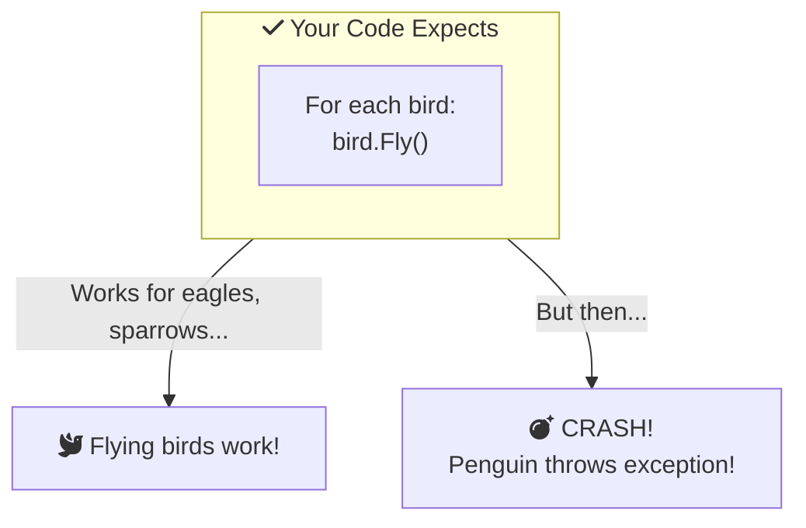

# Liskov Substitution Principle (LSP)

If it looks like a duck 🦆 and quacks like a duck , but needs batteries ... you probably have the wrong abstraction!

**The Liskov Substitution Principle is about keeping promises.**

---

## Section 1: The Duck Test 🦆

Imagine you have a pond full of ducks. One day, you add what looks like a duck:

| **Real Duck** 🦆 | **Mechanical Duck** 🤖 |
|:-----------------|:----------------------|
| Quacks | Quacks (with batteries) |
| Swims | Floats (doesn't work in rain) |
| Flies | Crashes into trees |
| Eats bread | Jams up with bread |

The mechanical duck **looks** like a duck, but it **doesn't behave** like one. If you expected a real duck and got a mechanical one, things would break!

<InfoBox type="tip">
**The LSP Says:** If class B extends class A, then you should be able to use B anywhere you use A **without surprises**.
</InfoBox>

### The Classic Example: Birds 

Here's the most famous LSP violation:

<SolidPrincipleDemo principle="L" mode="beginner" />

<ProgressCheckpoint section="lsp-introduction" xpReward={8} />

---

## Section 2: Why Is This a Problem?

Imagine you're building a bird game:

Your code expected all birds to fly. The penguin broke that promise!

### Real-World Analogies

| Expectation | Reality | Problem |
|:------------|:--------|:--------|
|  "All vehicles have wheels" | Boat is a vehicle | Boat breaks the promise |
|  "All boxes can be stacked" | Fragile box | Crushing = broken promise |
|  "All chargers fit my phone" | Wrong connector | Can't charge = broken promise |

<ProgressCheckpoint section="lsp-understanding" xpReward={9} />

---

## Section 3: The Simple Rule

> **"Derived classes must be able to substitute for their base classes."**
> — Barbara Liskov (1987)

Ask yourself:
- If I replace the parent class with a child class, will everything still work?
- Does my child class **keep all the promises** made by the parent?

### Good vs Bad Inheritance

| ** Bad** (Breaks LSP) | ** Good** (Follows LSP) |
|:------------------------|:-------------------------|
| Penguin extends Bird (with Fly method) | FlyingBird vs SwimmingBird |
| Square extends Rectangle | Shape interface |
| Stack extends ArrayList | Stack uses ArrayList |

### Key Takeaways

<InfoBox type="tip" title="Remember">
- 🦆 **Duck test** - If it looks like a duck, it should ACT like a duck
- 🤝 **Keep promises** - Child classes must honor parent class behavior
-  **Substitutability** - You can swap parent for child without problems
-  **No surprises** - Don't throw exceptions where parent doesn't
</InfoBox>

<ProgressCheckpoint section="lsp-application" xpReward={8} />
