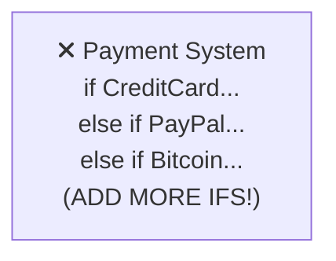
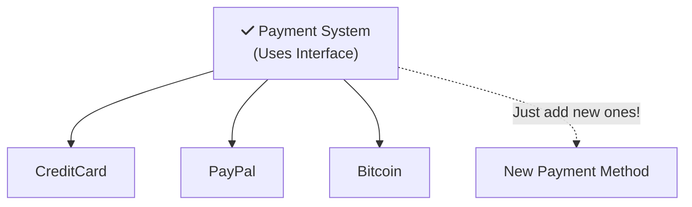

# Open/Closed Principle (OCP)

Imagine you have a power strip at home. When you buy a new lamp, do you need to rewire your entire house? Of course not! You just **plug it in**. 

**That's the magic of the Open/Closed Principle!**

---

## Section 1: The Power Strip Analogy 

| **Rewiring the House**  | **Using a Power Strip**  |
|:---------------------------|:----------------------------|
| Dangerous and risky | Safe and easy |
| Takes hours of work | Takes seconds |
| Might break existing stuff | Existing things keep working |
| Need an electrician | Anyone can do it |

The **Open/Closed Principle** says your code should work like a power strip: you can ADD new things without CHANGING what's already there.

<InfoBox type="tip">
**The OCP Says:** Software should be **open for extension** (add new features) but **closed for modification** (don't change existing code).
</InfoBox>

### The Game Console Analogy 

Think about a video game console:

- You can play **new games** without modifying the console
- The console is **closed** - you don't open it up and change the hardware
- Games are **extensions** - plug them in and they work!

<ProgressCheckpoint section="ocp-introduction" xpReward={8} />

---

## Section 2: Let's See the Problem

Here's code that forces you to "rewire the house" every time:

<SolidPrincipleDemo principle="O" mode="beginner" />

### Why Is Modification Bad?

Every time you **modify** existing code:

| Risk | What Could Happen |
|:-----|:------------------|
|  **New Bugs** | Breaking something that was working |
| 🧪 **Retest Everything** | Need to test ALL the old code again |
| ⏰ **Slow Development** | Changes take longer and longer |
|  **Fear of Change** | Developers avoid improving code |

### The Magic of Extension

Instead of modifying, we **extend**:

**OLD WAY (Modification):**

**NEW WAY (Extension):**

<ProgressCheckpoint section="ocp-understanding" xpReward={9} />

---

## Section 3: Real-World Examples

| Closed for Modification | Open for Extension |
|:------------------------|:-------------------|
| USB port design | New USB devices |
| Browser plugins API | New browser extensions |
| Phone app store | New apps |
| LEGO base plate | New LEGO pieces |

### The Simple Rule

> **"Add new features by writing NEW code, not by changing OLD code."**

Ask yourself:
- Do I need to modify existing code to add this feature?
- Can I instead create something NEW that plugs in?

### Key Takeaways

<InfoBox type="tip" title="Remember">
-  **Think like a power strip** - Let new things plug in
-  **Don't modify** - Changing old code is risky
-  **Do extend** - Add new code instead
-  **Like games on a console** - New games, same console
</InfoBox>

<ProgressCheckpoint section="ocp-application" xpReward={8} />
