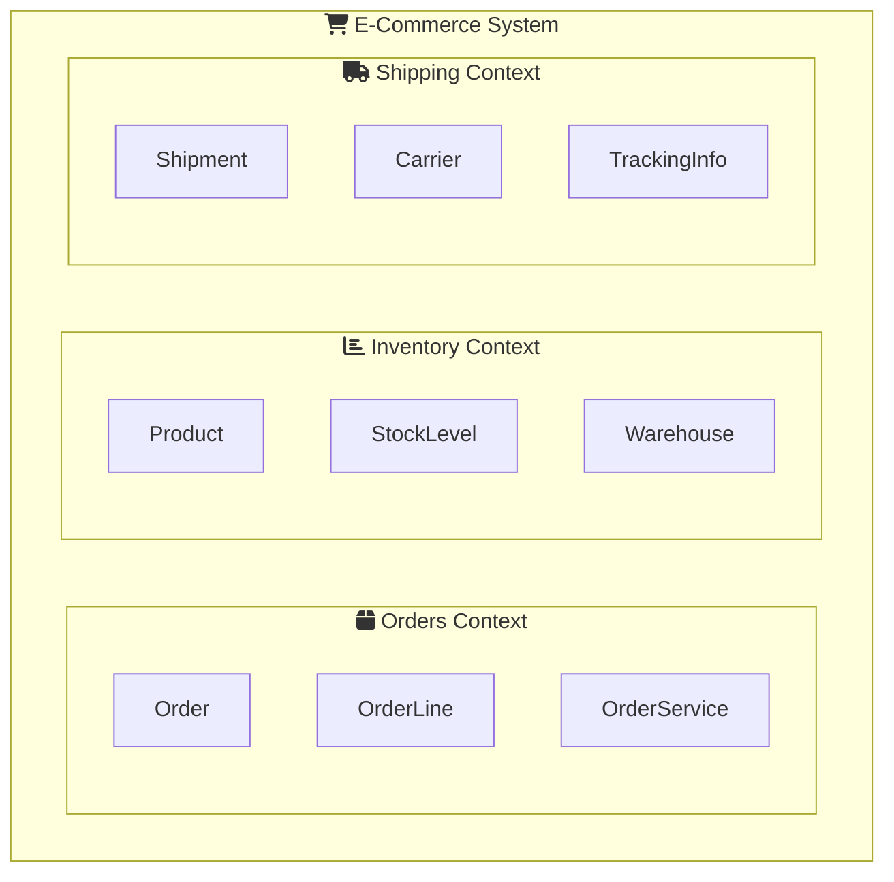

# Single Responsibility Principle (SRP) — Advanced

At the advanced level, we explore SRP in the context of **enterprise architecture**, **microservices**, and **domain-driven design**. Understanding the nuances helps you make architectural decisions that scale.

---

## Section 1: The True Definition

Robert C. Martin refines SRP as:

> **"A module should be responsible to one, and only one, actor."**

An **actor** is a group of stakeholders who request the same types of changes. This shifts focus from "doing one thing" to "serving one stakeholder."

### SRP at Different Scales

SRP applies at multiple architectural levels:

| Level | Unit | SRP Application |
|:------|:-----|:----------------|
| **Method** | Function | One specific operation |
| **Class** | Module | One cohesive concept |
| **Package** | Namespace | One business capability |
| **Service** | Microservice | One bounded context |

<InfoBox type="important">
**Architectural Insight:** In microservices architecture, each service should own ONE bounded context. SRP at the service level prevents distributed monoliths.
</InfoBox>

<ProgressCheckpoint section="srp-introduction" xpReward={20} />

---

## Section 2: Case Study - E-Commerce Order Service

### The Problem: Distributed Monolith

Consider an `OrderService` in a microservices architecture that violates SRP:

<DotnetCodePreview
  title="Anti-Pattern: The Order God Service"
  code={`public class OrderService
{
    public async Task<Order> PlaceOrder(OrderRequest request)
    {
        // 1. Validate inventory (Inventory domain)
        var available = await _inventoryClient.CheckStock(request.Items);
        if (!available) throw new OutOfStockException();
        
        // 2. Calculate pricing (Pricing domain)
        var price = await CalculateTotalWithDiscounts(request);
        
        // 3. Process payment (Payment domain)
        var charge = await _paymentClient.Charge(
            request.CustomerId, price);
            
        // 4. Update inventory (Inventory domain again)
        await _inventoryClient.Reserve(request.Items);
        
        // 5. Create shipping label (Shipping domain)
        var label = await _shippingClient.CreateLabel(
            request.ShippingAddress);
            
        // 6. Send notifications (Communication domain)
        await _emailClient.SendOrderConfirmation(request.CustomerId);
        await _smsClient.SendOrderSMS(request.CustomerPhone);
        
        return new Order { /* ... */ };
    }
}`}
  steps={[
    {
      lineNumbers: [5, 6, 7],
      highlight: "Inventory Responsibility",
      explanation: "Owned by Inventory Team - changes when stock management evolves"
    },
    {
      lineNumbers: [9, 10],
      highlight: "Pricing Responsibility",
      explanation: "Owned by Pricing Team - changes with promotions, tax rules"
    },
    {
      lineNumbers: [12, 13, 14],
      highlight: "Payment Responsibility",
      explanation: "Owned by Payments Team - changes with new payment providers"
    },
    {
      lineNumbers: [19, 20, 21],
      highlight: "Shipping Responsibility",
      explanation: "Owned by Logistics Team - changes with carriers"
    }
  ]}
/>

**Problems with this design:**

- ❌ **8 different teams** must coordinate for any change
- ❌ **Single failure** (e.g., SMS fails) blocks entire order
- ❌ **Testing nightmare** - requires mocking 7+ external services
- ❌ **Deployment coupling** - one team's change requires full redeploy

### The Solution: Event-Driven Architecture

<DotnetCodePreview
  title="SRP Applied: Choreography with Domain Events"
  code={`// Order Service: ONLY responsible for order lifecycle
public class OrderService
{
    private readonly IEventBus _eventBus;
    private readonly IOrderRepository _orders;
    
    public async Task<Order> PlaceOrder(OrderRequest request)
    {
        // Create order in PENDING state
        var order = Order.CreatePending(request);
        await _orders.Save(order);
        
        // Publish event - let other domains react
        await _eventBus.Publish(new OrderPlacedEvent
        {
            OrderId = order.Id,
            Items = request.Items,
            CustomerId = request.CustomerId
        });
        
        return order;
    }
}

// Inventory Service: Reacts to OrderPlaced
public class InventoryEventHandler
{
    public async Task Handle(OrderPlacedEvent e)
    {
        var reserved = await _inventory.TryReserve(e.Items);
        
        if (reserved)
            await _eventBus.Publish(new InventoryReservedEvent(e.OrderId));
        else
            await _eventBus.Publish(new InventoryFailedEvent(e.OrderId));
    }
}`}
  steps={[
    {
      lineNumbers: [2, 3, 4, 5, 6, 7, 8, 9, 10, 11, 12, 13, 14, 15, 16, 17, 18, 19, 20, 21, 22],
      highlight: "Order Service",
      explanation: "Now ONLY manages order state. Publishes events for others to react."
    },
    {
      lineNumbers: [25, 26, 27, 28, 29, 30, 31, 32, 33, 34, 35],
      highlight: "Inventory Handler",
      explanation: "Separate service. Change inventory logic without touching orders."
    }
  ]}
/>

<ProgressCheckpoint section="srp-understanding" xpReward={20} />

---

## Section 3: SRP and Domain-Driven Design

In DDD, SRP aligns with **Bounded Contexts**:



Each bounded context:
- Has its **own data store**
- Uses its **own ubiquitous language**
- Serves its **own set of actors**
- Can be **deployed independently**

<SolidPrincipleDemo principle="S" mode="advanced" />

### Measuring SRP Compliance

| Metric | Good Value | Tool |
|:-------|:-----------|:-----|
| **Class lines** | < 200 | Code analysis |
| **Methods per class** | < 10 | NDepend |
| **Dependencies** | < 5 | JetBrains dotCover |
| **Cyclomatic complexity** | < 10 | SonarQube |

### Best Practices for Enterprise SRP

**1. Use Mediator Pattern for Orchestration**
```csharp
public class PlaceOrderHandler : IRequestHandler<PlaceOrderCommand, Order>
{
    public async Task<Order> Handle(PlaceOrderCommand cmd, CancellationToken ct)
    {
        var order = await _orderService.Create(cmd);
        await _mediator.Publish(new OrderCreated(order.Id));
        return order;
    }
}
```

**2. Apply at Package Level**
```
src/
├── Orders/
│   ├── Commands/       # Write operations
│   ├── Queries/        # Read operations
│   └── Domain/         # Core business logic
├── Inventory/          # Separate bounded context
└── Shipping/           # Separate bounded context
```

### Key Takeaways

<InfoBox type="tip" title="Remember">
- 🏢 **SRP scales** from methods to microservices
- 🎭 **Actor-focused** - Organize by who requests changes
- 📡 **Event-driven** - Use events to decouple responsibilities
- 🎯 **Bounded contexts** - DDD aligns naturally with SRP
- ⚖️ **Context matters** - Balance purity with pragmatism
</InfoBox>

<ProgressCheckpoint section="srp-application" xpReward={20} />
