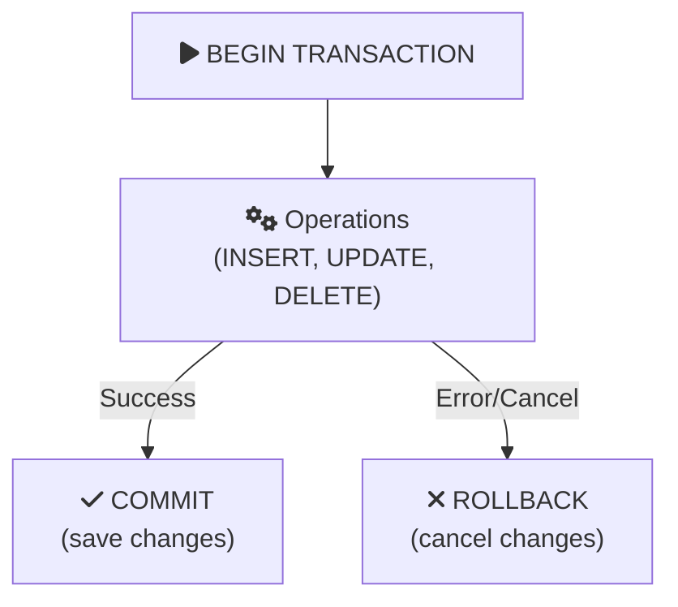

# BEGIN TRANSACTION: Starting a Transaction

Group multiple operations into a single atomic unit!

## 🚀 What is BEGIN TRANSACTION?

BEGIN TRANSACTION starts a transaction - a group of operations that succeed or fail together:

```sql
BEGIN TRANSACTION;
    -- All operations here are one unit
    UPDATE accounts SET balance = balance - 100 WHERE id = 1;
    UPDATE accounts SET balance = balance + 100 WHERE id = 2;
COMMIT;  -- Save all changes
```

## 📝 Syntax Variations

```sql
-- SQL Server
BEGIN TRANSACTION;
BEGIN TRAN;

-- PostgreSQL
BEGIN;
BEGIN TRANSACTION;
BEGIN WORK;

-- MySQL
START TRANSACTION;
BEGIN;
```

## 🎯 Simple Example

```sql
-- Transfer money between accounts
BEGIN TRANSACTION;
    UPDATE accounts SET balance = balance - 500 WHERE id = 1;
    UPDATE accounts SET balance = balance + 500 WHERE id = 2;
COMMIT;
-- Both updates happen together!
```

## 🔄 Transaction Flow



## ⚡ Auto-commit Mode

Without explicit transaction, each statement auto-commits:

```sql
-- These are separate transactions!
UPDATE accounts SET balance = 100 WHERE id = 1;  -- Committed immediately
UPDATE accounts SET balance = 200 WHERE id = 2;  -- Committed immediately

-- With explicit transaction:
BEGIN TRANSACTION;
    UPDATE accounts SET balance = 100 WHERE id = 1;
    UPDATE accounts SET balance = 200 WHERE id = 2;
COMMIT;  -- Both committed together
```

## 💡 When to Use Transactions

1. **Multiple related updates** - All must succeed
2. **Money transfers** - Debit and credit together
3. **Complex operations** - Need rollback option
4. **Data integrity** - Enforce business rules

<ProgressCheckpoint section="begin-transaction-complete" xpReward={20} />
