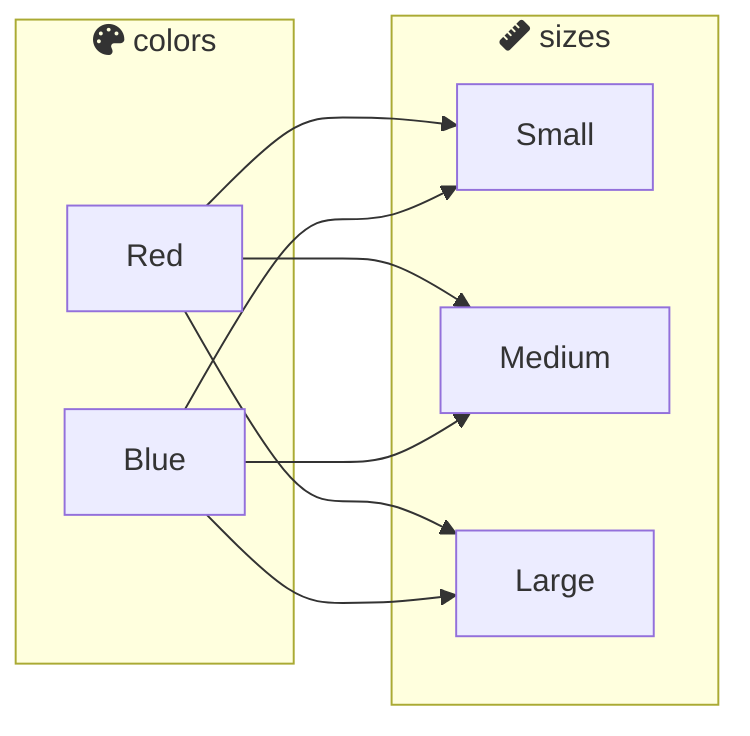

# CROSS JOIN: All Possible Combinations

Create every combination of rows from two tables!

## ✖️ What is CROSS JOIN?

CROSS JOIN produces the Cartesian product - every row from table A paired with every row from table B:

```sql
SELECT * FROM colors CROSS JOIN sizes;
```

## 📊 Visual Example



**CROSS JOIN Result:** 2 × 3 = **6 rows**

| color | size |
|:---:|:---:|
| Red | Small |
| Red | Medium |
| Red | Large |
| Blue | Small |
| Blue | Medium |
| Blue | Large |

## 📝 Syntax

```sql
-- Explicit CROSS JOIN
SELECT * FROM table_a CROSS JOIN table_b;

-- Implicit (old style - same result)
SELECT * FROM table_a, table_b;
```

## ⚠️ Warning: Row Explosion!

CROSS JOIN multiplies rows:

- 100 rows × 100 rows = 10,000 rows!
- 1,000 × 1,000 = 1,000,000 rows!

Only use when you need all combinations!

## 🎯 Good Use Cases

### 1. Product Variants

```sql
-- Generate all size/color combinations
SELECT p.name, c.color, s.size
FROM products p
CROSS JOIN colors c
CROSS JOIN sizes s;
```

### 2. Date Ranges with All Items

```sql
-- All dates × all products for reporting
SELECT d.date, p.product_id
FROM dates d
CROSS JOIN products p;
```

### 3. Generate Test Data

```sql
-- All combinations of first/last names
SELECT f.first_name, l.last_name
FROM first_names f
CROSS JOIN last_names l;
```

## 💡 Key Points

- No ON clause needed
- Result size = rows in A × rows in B
- Use carefully with large tables!

<ProgressCheckpoint section="cross-join-complete" xpReward={20} />
