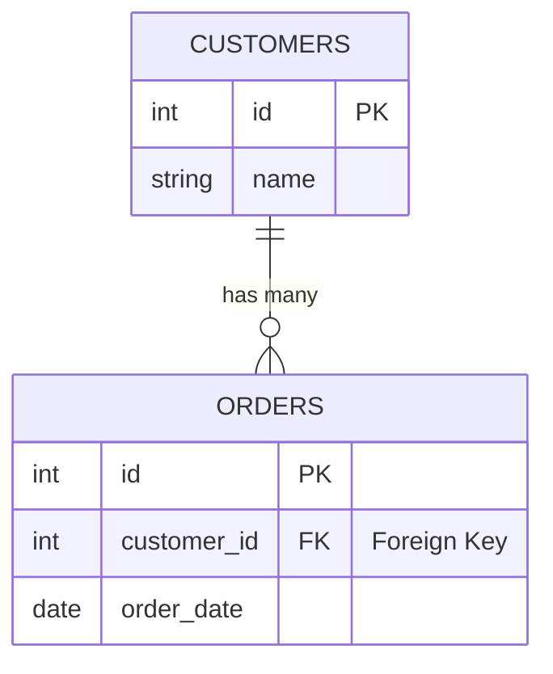

# Foreign Keys: Connecting Tables

Foreign keys link tables together, like connecting puzzle pieces!

## 🔗 What is a Foreign Key?

A foreign key is a column that **references** the primary key of another table.



**Sample Data:**
| customers.id | customers.name | | orders.id | orders.customer_id |
|:---:|:---:|---|:---:|:---:|
| 1 | Alice | ← | 1 | 1 |
| 2 | Bob | | 2 | 1 |
| | | | 3 | 2 |

## 📝 Creating a Foreign Key

```sql
-- Parent table (referenced)
CREATE TABLE customers (
    id INT PRIMARY KEY,
    name VARCHAR(100)
);

-- Child table (references customers)
CREATE TABLE orders (
    id INT PRIMARY KEY,
    customer_id INT,
    order_date DATE,
    FOREIGN KEY (customer_id) REFERENCES customers(id)
);
```

## ✅ What Foreign Keys Do

1. **Ensure valid references** - Can't order for non-existent customer
2. **Prevent orphan records** - Can't delete customer with orders
3. **Document relationships** - Clear data structure

```sql
-- This works: customer 1 exists
INSERT INTO orders (id, customer_id, order_date)
VALUES (1, 1, '2024-03-15');

-- This fails: customer 999 doesn't exist!
INSERT INTO orders (id, customer_id, order_date)
VALUES (2, 999, '2024-03-15');
-- Error: Foreign key constraint violation
```

## 🛡️ Protection in Action

```sql
-- Can't delete a customer who has orders
DELETE FROM customers WHERE id = 1;
-- Error: The DELETE statement conflicted with the FOREIGN KEY constraint
```

## 📊 Common Relationship Types

| Type         | Example            | FK Location          |
| ------------ | ------------------ | -------------------- |
| One-to-Many  | Customer → Orders  | Child table (orders) |
| One-to-One   | User → Profile     | Either table         |
| Many-to-Many | Students ↔ Courses | Junction table       |

## 💡 Named Foreign Keys

Give your constraints meaningful names:

```sql
CREATE TABLE orders (
    id INT PRIMARY KEY,
    customer_id INT,
    CONSTRAINT FK_orders_customers
        FOREIGN KEY (customer_id) REFERENCES customers(id)
);
```

<ProgressCheckpoint section="foreign-key-complete" xpReward={30} />
