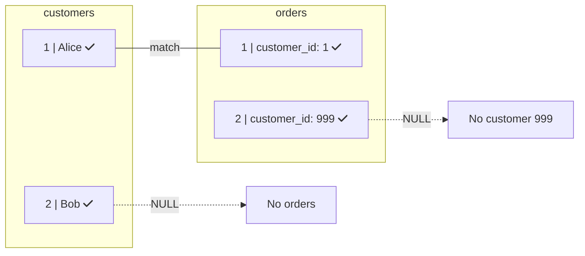

# FULL OUTER JOIN: Keep Everything

Return all rows from both tables, matched or not!

## 🔗 What is FULL OUTER JOIN?

Combines LEFT JOIN and RIGHT JOIN - keeps ALL rows from BOTH tables:

```sql
SELECT c.name, o.id AS order_id
FROM customers c
FULL OUTER JOIN orders o ON c.id = o.customer_id;
```

## 📊 Visual Example



**FULL OUTER JOIN Result:**

| name | order_id |
|:---:|:---:|
| Alice | 1 |
| Bob | **NULL** |
| **NULL** | 2 |

> Keeps ALL rows from BOTH tables - unmatched rows show NULL

## 📝 Syntax

```sql
SELECT columns
FROM table_a
FULL OUTER JOIN table_b ON table_a.id = table_b.a_id;

-- FULL OUTER JOIN = FULL JOIN (same thing)
```

## 🎯 Common Use Cases

### 1. Data Reconciliation

```sql
-- Compare two systems
SELECT
    COALESCE(local.id, remote.id) AS id,
    local.value AS local_value,
    remote.value AS remote_value,
    CASE
        WHEN local.id IS NULL THEN 'Missing locally'
        WHEN remote.id IS NULL THEN 'Missing remotely'
        WHEN local.value <> remote.value THEN 'Different'
        ELSE 'Match'
    END AS status
FROM local_data local
FULL OUTER JOIN remote_data remote ON local.id = remote.id;
```

### 2. Find All Mismatches

```sql
SELECT *
FROM table_a a
FULL OUTER JOIN table_b b ON a.key = b.key
WHERE a.key IS NULL OR b.key IS NULL;
```

## 💡 Key Points

- Returns matched rows PLUS unmatched from BOTH sides
- NULL appears where no match exists
- Less common than LEFT/INNER JOIN

<ProgressCheckpoint section="full-outer-join-complete" xpReward={20} />
