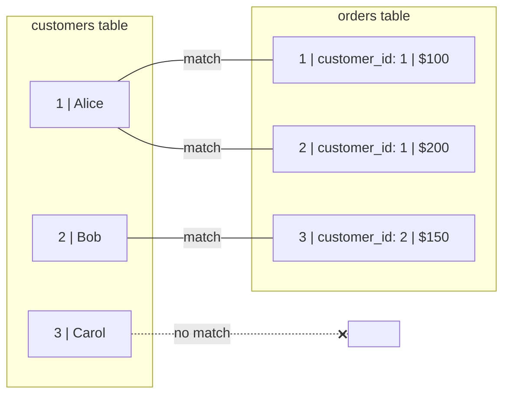

# INNER JOIN: Combining Tables

Learn to connect data from multiple tables!

## 🔗 What is a JOIN?

A JOIN combines rows from two or more tables based on a related column:

```sql
SELECT orders.id, customers.name, orders.total
FROM orders
INNER JOIN customers ON orders.customer_id = customers.id;
```

## 📊 Visual: How INNER JOIN Works



**INNER JOIN Result:** Only matching rows!

| order_id | name | total |
|:---:|:---:|:---:|
| 1 | Alice | 100 |
| 2 | Alice | 200 |
| 3 | Bob | 150 |

> Carol has no orders, so she's **not** in the result

## 📝 Basic Syntax

```sql
SELECT columns
FROM table1
INNER JOIN table2 ON table1.column = table2.column;

-- INNER is optional, these are equivalent:
INNER JOIN customers ON ...
JOIN customers ON ...
```

## 🎯 Real Examples

```sql
-- Orders with customer names
SELECT o.id, c.name, o.total, o.order_date
FROM orders o
INNER JOIN customers c ON o.customer_id = c.id;

-- Products with category names
SELECT p.name AS product, c.name AS category, p.price
FROM products p
INNER JOIN categories c ON p.category_id = c.id;
```

## ✏️ Table Aliases

Use short aliases for cleaner queries:

```sql
-- Without alias (verbose)
SELECT orders.id, customers.name
FROM orders
INNER JOIN customers ON orders.customer_id = customers.id;

-- With alias (clean)
SELECT o.id, c.name
FROM orders o
INNER JOIN customers c ON o.customer_id = c.id;
```

## 💡 Key Points

- INNER JOIN returns only matching rows
- No match = row excluded from result
- Always specify the join condition with ON

<ProgressCheckpoint section="inner-join-complete" xpReward={30} />
