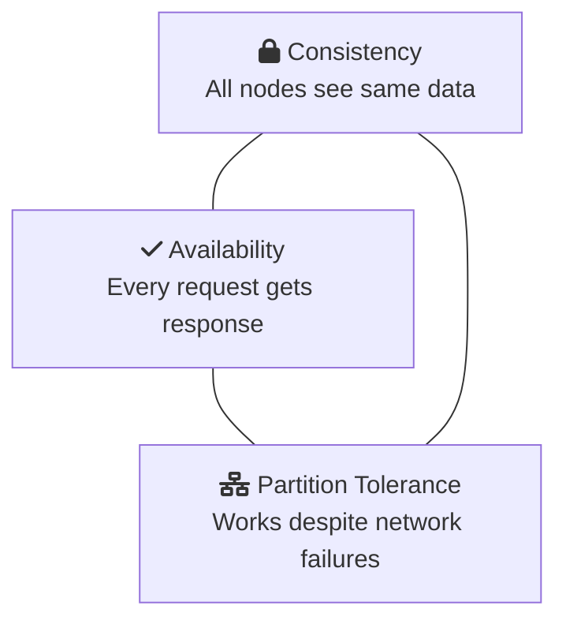
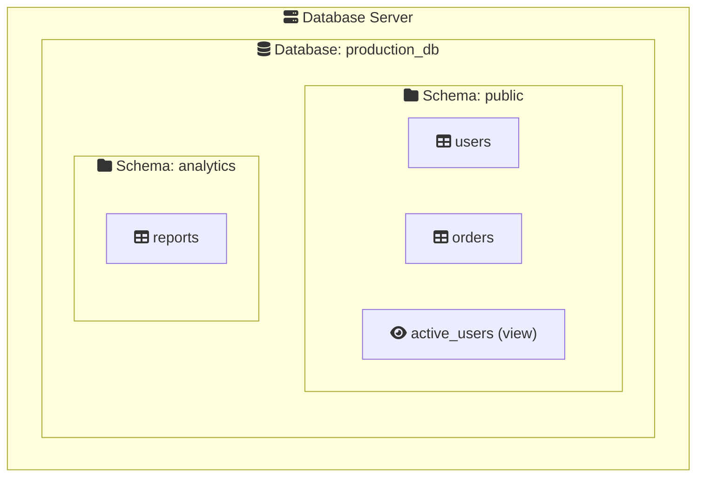

# Advanced Database Concepts

Let&apos;s explore the deeper architectural decisions and trade-offs in database systems.

## CAP Theorem: The Fundamental Trade-off

In distributed systems, you can only guarantee two of three properties:



> **Pick 2:** You can only guarantee two of these three properties!

| Database Type     | Prioritizes | Trade-off                         |
| :---------------- | :---------- | :-------------------------------- |
| Traditional RDBMS | CA          | May not handle network partitions |
| MongoDB           | CP          | May sacrifice availability        |
| Cassandra         | AP          | Eventually consistent             |

## Transaction Isolation Levels

Different isolation levels balance consistency vs performance:

```sql
-- From strictest to most permissive:
SET TRANSACTION ISOLATION LEVEL SERIALIZABLE;      -- Strongest
SET TRANSACTION ISOLATION LEVEL REPEATABLE READ;   -- Default in many DBs
SET TRANSACTION ISOLATION LEVEL READ COMMITTED;    -- Good balance
SET TRANSACTION ISOLATION LEVEL READ UNCOMMITTED;  -- Fastest, risky
```

| Level            | Dirty Reads | Non-Repeatable Reads | Phantom Reads |
| :--------------- | :---------- | :------------------- | :------------ |
| Serializable     |            |                     |              |
| Repeatable Read  |            |                     | Possible      |
| Read Committed   |            | Possible             | Possible      |
| Read Uncommitted | Possible    | Possible             | Possible      |

<RdbmsConceptVisualizer mode="advanced" />

## B-Tree vs LSM-Tree: Storage Engine Internals

### B-Tree (Traditional RDBMS)

- Optimized for **reads**
- Updates in-place
- Used by PostgreSQL, MySQL InnoDB

```
     [50]
    /    \
  [25]   [75]
  / \    /  \
[10][30][60][90]
```

### LSM-Tree (Write-Optimized)

- Optimized for **writes**
- Append-only, periodic compaction
- Used by Cassandra, RocksDB

```
Memory: [new writes buffer]
         ↓
Level 0: [SST files]
         ↓ merge
Level 1: [larger SST files]
```

## MVCC: Multi-Version Concurrency Control

Instead of locking rows, MVCC keeps multiple versions:

```sql
-- Transaction 1 sees version 1
BEGIN; SELECT balance FROM accounts WHERE id = 1;
-- Returns: 1000 (version 1)

-- Meanwhile, Transaction 2 updates
UPDATE accounts SET balance = 500 WHERE id = 1;
COMMIT;
-- Creates version 2

-- Transaction 1 still sees version 1
SELECT balance FROM accounts WHERE id = 1;
-- Returns: 1000 (still version 1, snapshot isolation)

COMMIT;
-- Now Transaction 1 would see version 2
```

## Database vs Schema vs Table

Hierarchy in most RDBMS:



## SQL vs NoSQL: When to Choose What

| Use Case             | Best Choice         | Reasoning                                |
| :------------------- | :------------------ | :--------------------------------------- |
| Banking transactions | SQL                 | ACID guarantees critical                 |
| User session storage | NoSQL (Redis)       | High speed, simple structure             |
| Social media posts   | Either              | Depends on query patterns                |
| IoT sensor data      | NoSQL (TimescaleDB) | High write volume                        |
| E-commerce catalog   | Hybrid              | SQL for orders, NoSQL for product search |

## NewSQL: The Best of Both Worlds?

Modern databases like CockroachDB, TiDB, and Spanner offer:

- SQL interface
- ACID transactions
- Horizontal scalability
- Geographic distribution

```sql
-- CockroachDB: Distributed SQL
CREATE TABLE users (
    id UUID PRIMARY KEY DEFAULT gen_random_uuid(),
    name STRING,
    region STRING
) PARTITION BY LIST (region) (
    PARTITION us VALUES IN ('us-east', 'us-west'),
    PARTITION eu VALUES IN ('eu-west', 'eu-central')
);
```

<ProgressCheckpoint section="learn-basics-complete" xpReward={70} />
