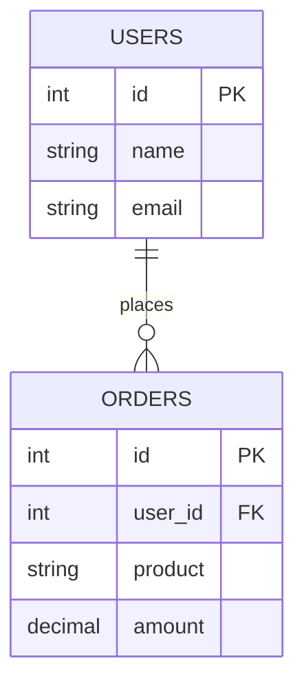

# What is SQL?

Welcome to the world of databases! SQL (Structured Query Language) is the universal language for managing and querying data. Let's discover why it's so important.

## ️ Imagine Your Data as a Filing Cabinet

Think of a database like a giant, super-organized filing cabinet:

| Real World                     | Database Term    |
| :----------------------------- | :--------------- |
| Filing Cabinet                 | Database         |
| Drawer (e.g., "Customers")     | Table            |
| Folder inside drawer           | Row (Record)     |
| Labels on folder (Name, Phone) | Columns (Fields) |

> **The Big Idea:** SQL is how you ask questions and give instructions to this filing cabinet!

## Explore RDBMS Concepts

Use the interactive visualizer below to understand how tables, rows, columns, and keys work together:

<RdbmsConceptVisualizer mode="beginner" />

##  What Makes Databases "Relational"?

The "R" in RDBMS stands for **Relational**. This means tables can be connected to each other:

This connection (relationship) lets you answer questions like:

- "What did Alice order?"
- "Who bought the most expensive item?"

## SQL vs NoSQL: Quick Overview

| Feature   | SQL (Relational)              | NoSQL                          |
| :-------- | :---------------------------- | :----------------------------- |
| Structure | Fixed tables, rows, columns   | Flexible: documents, key-value |
| Best For  | Complex queries, transactions | High speed, unstructured data  |
| Examples  | MySQL, PostgreSQL, SQL Server | MongoDB, Redis, Cassandra      |
| Analogy   | Library catalog system        | Folder full of sticky notes    |

##  Why Learn SQL?

1. **Universal** - Works with almost all databases
2. **In-Demand** - Required for data analysts, developers, DBAs
3. **Powerful** - Query millions of records in seconds
4. **Foundational** - Even NoSQL databases often support SQL-like queries

## Quick Check 

Before moving on, make sure you understand:

- A **database** stores organized data in **tables**
- Tables have **columns** (types of data) and **rows** (actual records)
- **SQL** is the language to interact with this data
- **Relational** means tables can connect to each other

<ProgressCheckpoint section="learn-basics-complete" xpReward={25} />
