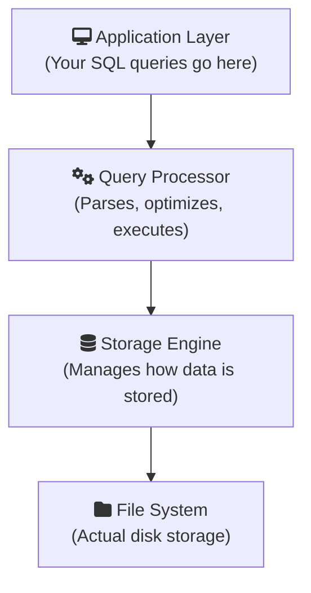

# Understanding RDBMS Architecture

Now that you know the basics, let's dive deeper into how relational database management systems actually work.

## 🏗️ RDBMS Architecture Layers

A database management system has several key components:



## ACID Properties: The Foundation of Reliability

Every reliable database guarantees these four properties:

| Property        | Meaning                           | Example                                           |
| :-------------- | :-------------------------------- | :------------------------------------------------ |
| **A**tomicity   | All or nothing                    | Transfer $100: both accounts update or neither    |
| **C**onsistency | Valid state to valid state        | Balance can&apos;t go negative if rule exists     |
| **I**solation   | Transactions don&apos;t interfere | Two transfers at once don&apos;t corrupt data     |
| **D**urability  | Committed = permanent             | Power loss won&apos;t lose confirmed transactions |

<RdbmsConceptVisualizer mode="intermediate" />

## Normalization: Organizing Data Efficiently

Normalization reduces data redundancy. Consider this denormalized table:

```sql
-- BAD: Repeated data
| OrderID | CustomerName | CustomerEmail    | Product |
|---------|--------------|------------------|---------|
| 1       | Alice        | alice@email.com  | Laptop  |
| 2       | Alice        | alice@email.com  | Mouse   |
```

**Problem:** If Alice changes her email, you must update it in every row!

**Solution:** Normalize into two tables:

```sql
-- Customers Table
| CustomerID | Name  | Email           |
|------------|-------|-----------------|
| 1          | Alice | alice@email.com |

-- Orders Table
| OrderID | CustomerID | Product |
|---------|------------|---------|
| 1       | 1          | Laptop  |
| 2       | 1          | Mouse   |
```

## SQL Standard vs Vendor Extensions

SQL has an ANSI standard, but each database adds its own features:

| Feature        | Standard SQL | PostgreSQL | SQL Server | MySQL            |
| :------------- | :----------- | :--------- | :--------- | :--------------- | --- | --- | --- | ---------- |
| Auto-increment | Not standard | `SERIAL`   | `IDENTITY` | `AUTO_INCREMENT` |
| String concat  | `            |            | `          | `                |     | `   | `+` | `CONCAT()` |
| Limit rows     | Not original | `LIMIT`    | `TOP`      | `LIMIT`          |

> **Best Practice:** Learn standard SQL first, then vendor-specific features.

## Relational Model Theory

The relational model, proposed by E.F. Codd in 1970, is based on mathematical set theory:

- **Relation** = Table
- **Tuple** = Row
- **Attribute** = Column
- **Domain** = Valid values for an attribute

```sql
-- Relational algebra operations map to SQL:
-- Selection (σ) → WHERE
-- Projection (π) → SELECT specific columns
-- Join (⋈) → JOIN
```

## Practice: Database Design Thinking

When designing a database, ask:

1. What **entities** (things) do I need to track?
2. What **attributes** (properties) does each entity have?
3. How do entities **relate** to each other?

<ProgressCheckpoint section="learn-basics-complete" xpReward={45} />
