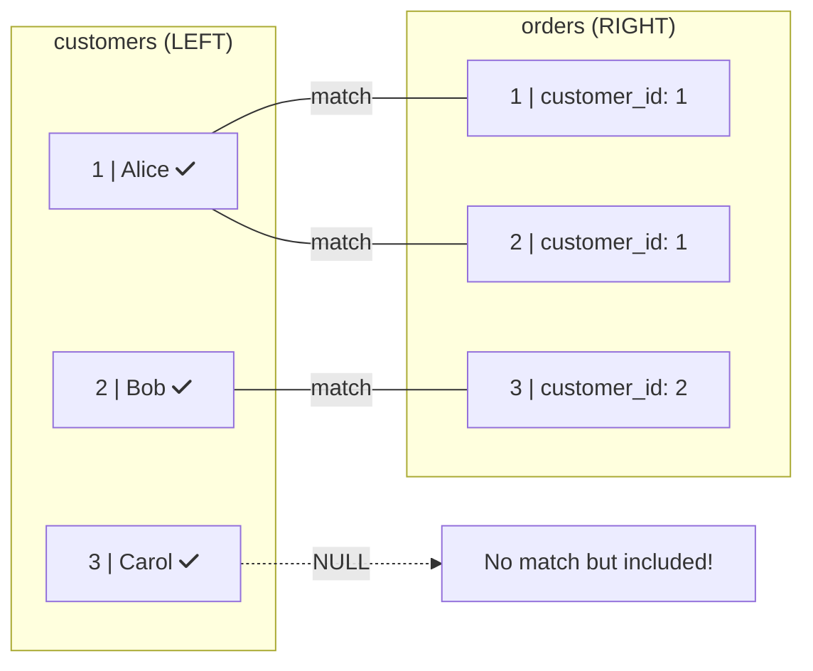

# LEFT JOIN: Keep All Left Rows

Include all rows from the left table, even without matches!

## 🔗 What is LEFT JOIN?

LEFT JOIN returns ALL rows from the left table, plus matching rows from the right:

```sql
SELECT c.name, o.id AS order_id
FROM customers c
LEFT JOIN orders o ON c.id = o.customer_id;
```

## 📊 Visual: How LEFT JOIN Works



**LEFT JOIN Result:**

| name | order_id |
|:---:|:---:|
| Alice | 1 |
| Alice | 2 |
| Bob | 3 |
| Carol | **NULL** |

> Carol has NO orders, but is **still included** with NULL!

## 🎯 When to Use LEFT JOIN

- Show all items even without matches
- Find "orphan" records
- Reports that need complete lists

## 📝 Syntax

```sql
SELECT columns
FROM left_table
LEFT JOIN right_table ON left_table.id = right_table.foreign_id;

-- LEFT JOIN = LEFT OUTER JOIN (same thing)
```

## 🔍 Finding "No Match" Rows

```sql
-- Customers with NO orders
SELECT c.*
FROM customers c
LEFT JOIN orders o ON c.id = o.customer_id
WHERE o.id IS NULL;

-- Products never sold
SELECT p.*
FROM products p
LEFT JOIN order_items oi ON p.id = oi.product_id
WHERE oi.id IS NULL;
```

## ⚠️ NULL Columns

When no match: right table columns are NULL

```sql
SELECT c.name, o.total
FROM customers c
LEFT JOIN orders o ON c.id = o.customer_id;

-- Carol's order total will be NULL
```

<ProgressCheckpoint section="left-join-complete" xpReward={25} />
