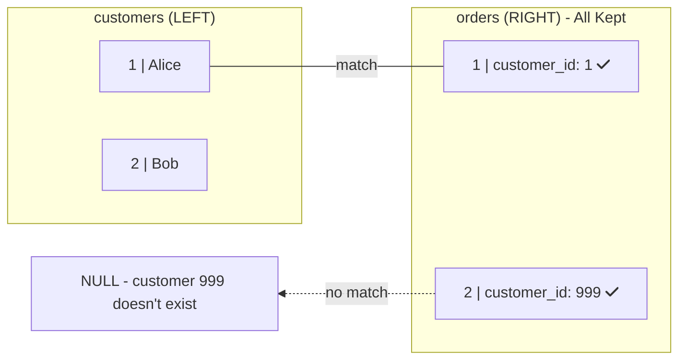

# RIGHT JOIN: Keep All Right Rows

Keep all rows from the right table, match from left.

## 🔗 What is RIGHT JOIN?

RIGHT JOIN is the mirror of LEFT JOIN - it keeps all rows from the RIGHT table:

```sql
SELECT o.id, c.name
FROM customers c
RIGHT JOIN orders o ON c.id = o.customer_id;
-- Keeps all orders, shows NULL for customer if no match
```

## 📊 Visual Example



**RIGHT JOIN Result:**

| order_id | name |
|:---:|:---:|
| 1 | Alice |
| 2 | **NULL** |

> Order 2 exists but has no matching customer, shown with NULL

## 🔄 RIGHT JOIN = Reversed LEFT JOIN

These are equivalent:

```sql
-- RIGHT JOIN
SELECT * FROM a RIGHT JOIN b ON a.id = b.a_id;

-- Same as LEFT JOIN with swapped tables
SELECT * FROM b LEFT JOIN a ON a.id = b.a_id;
```

## 💡 Why LEFT JOIN is Preferred

Most developers use LEFT JOIN instead:

```sql
-- Instead of RIGHT JOIN:
SELECT o.*, c.name
FROM customers c
RIGHT JOIN orders o ON c.id = o.customer_id;

-- Use LEFT JOIN (swap table order):
SELECT o.*, c.name
FROM orders o
LEFT JOIN customers c ON o.customer_id = c.id;

-- Same result, easier to read!
```

## 🎯 When RIGHT JOIN is Useful

1. When you can't reorder tables (complex queries)
2. When right table is the focus of your query
3. When existing query logic requires it

```sql
-- Find orders with missing customer data
SELECT o.*
FROM customers c
RIGHT JOIN orders o ON c.id = o.customer_id
WHERE c.id IS NULL;
```

<ProgressCheckpoint section="right-join-complete" xpReward={20} />
