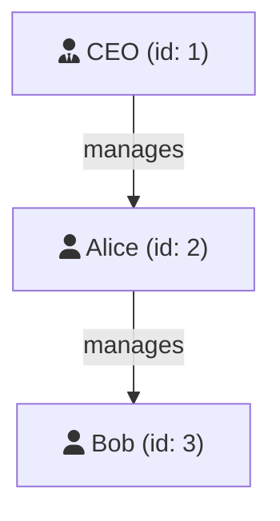

# Self Join: Joining a Table to Itself

Compare rows in the same table using self-join!

##  What is a Self Join?

A self join joins a table to itself - like comparing siblings in the same family:

```sql
SELECT
    e.name AS employee,
    m.name AS manager
FROM employees e
INNER JOIN employees m ON e.manager_id = m.id;
```

##  Visual Example



**employees table:**

| id | name | manager_id |
|:---:|:---:|:---:|
| 1 | CEO | NULL |
| 2 | Alice | 1 (→ CEO) |
| 3 | Bob | 2 (→ Alice) |

**Self Join Result:**

| employee | manager |
|:---:|:---:|
| Alice | CEO |
| Bob | Alice |

##  Key: Use Different Aliases!

```sql
-- MUST use different aliases for the same table
FROM employees e        -- e = employee
INNER JOIN employees m  -- m = manager
ON e.manager_id = m.id
```

##  Common Use Cases

### 1. Employee-Manager Hierarchy

```sql
SELECT e.name AS employee, m.name AS manager
FROM employees e
LEFT JOIN employees m ON e.manager_id = m.id;
-- LEFT JOIN includes employees with no manager (CEO)
```

### 2. Find Pairs

```sql
-- Find all pairs of products in same category
SELECT p1.name, p2.name
FROM products p1
INNER JOIN products p2
    ON p1.category_id = p2.category_id
    AND p1.id < p2.id;  -- Avoid duplicates and self-match
```

### 3. Compare Related Records

```sql
-- Orders and their previous order
SELECT
    o1.id AS order_id,
    o1.order_date,
    o2.id AS previous_order_id
FROM orders o1
LEFT JOIN orders o2
    ON o1.customer_id = o2.customer_id
    AND o2.order_date < o1.order_date;
```

##  Key Points

- Same table, different aliases
- Used for hierarchies and comparisons
- Often combined with conditions to avoid self-matching

<ProgressCheckpoint section="self-join-complete" xpReward={25} />
