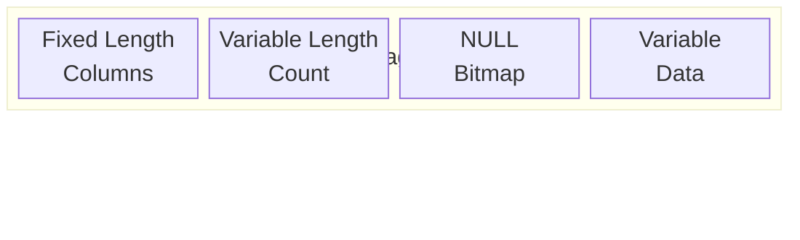

# SQL Data Types: Advanced Considerations

Master the nuances of data types for optimal database design and performance.

## Storage Internals

### How Data Types Affect Storage



> INT uses fixed 4 bytes, while VARCHAR has 2 bytes overhead + actual data length

### Page and Row Size Limits

| Database       | Max Row Size | Max Columns |
| -------------- | ------------ | ----------- |
| SQL Server     | 8,060 bytes  | 1,024       |
| PostgreSQL     | 1.6 TB       | 1,600       |
| MySQL (InnoDB) | 65,535 bytes | 4,096       |

```sql
-- Overflow storage for large data
-- SQL Server: ROW_OVERFLOW_DATA (VARCHAR > 8000)
-- PostgreSQL: TOAST (auto-compressed)
```

## Vendor-Specific Types

### PostgreSQL Unique Types

| Type      | Description         | Use Case          |
| --------- | ------------------- | ----------------- |
| SERIAL    | Auto-increment      | Primary keys      |
| UUID      | 128-bit identifiers | Distributed IDs   |
| JSONB     | Binary JSON         | Document storage  |
| ARRAY     | Array of values     | Tags, multi-value |
| INET/CIDR | IP addresses        | Network data      |
| TSTZRANGE | Time ranges         | Scheduling        |

```sql
-- PostgreSQL arrays
CREATE TABLE posts (
    tags TEXT[] DEFAULT '{}'
);
INSERT INTO posts (tags) VALUES (ARRAY['sql', 'tutorial']);
SELECT * FROM posts WHERE 'sql' = ANY(tags);
```

### SQL Server Specific Types

| Type        | Description        | Use Case                          |
| ----------- | ------------------ | --------------------------------- |
| MONEY       | 8-byte currency    | Financial (use DECIMAL preferred) |
| HIERARCHYID | Tree paths         | Org charts                        |
| GEOGRAPHY   | Spatial data       | Maps, GPS                         |
| ROWVERSION  | Auto-update binary | Concurrency                       |
| SQL_VARIANT | Any type           | Flexible columns                  |

### MySQL Specific Types

| Type      | Description              |
| --------- | ------------------------ |
| ENUM      | Fixed set of values      |
| SET       | Multiple values from set |
| YEAR      | 1901-2155                |
| MEDIUMINT | 3-byte integer           |

## Type Selection Strategy

### Performance Implications

```sql
-- Smaller types = more rows per page = faster scans
-- Bad: Using BIGINT when INT suffices
user_id BIGINT  -- 8 bytes × 1M rows = 8 MB wasted

-- Good: Right-sized types
user_id INT     -- 4 bytes × 1M rows = 4 MB saved
```

### Index Size Impact

| Column Type         | Index Size per 1M rows |
| ------------------- | ---------------------- |
| INT                 | ~4 MB                  |
| BIGINT              | ~8 MB                  |
| CHAR(36) (UUID)     | ~36 MB                 |
| VARCHAR(255) avg 20 | ~22 MB                 |

## Domain Modeling Best Practices

### Money and Financial Data

```sql
-- ALWAYS use DECIMAL for money
price DECIMAL(19, 4),  -- Supports 15 digits + 4 decimals

-- Store in smallest unit (cents) as INT
price_cents INT,  -- $10.99 stored as 1099

-- Currency-aware
amount DECIMAL(19, 4),
currency CHAR(3)  -- 'USD', 'EUR', 'GBP'
```

### Temporal Data

```sql
-- Use appropriate precision
created_at DATETIME2(3),  -- Millisecond precision
log_time DATETIME2(7),    -- 100 nanoseconds (max)

-- Store UTC, display local
created_at_utc DATETIME2,
-- OR use offset-aware type
created_at DATETIMEOFFSET
```

### Unicode Considerations

```sql
-- ASCII-only (English)
username VARCHAR(50)

-- International text
display_name NVARCHAR(100)  -- SQL Server
display_name VARCHAR(100)   -- PostgreSQL (UTF-8 default)
display_name VARCHAR(100) CHARACTER SET utf8mb4  -- MySQL
```

## NULL Handling Deep Dive

```sql
-- NULLs in comparisons
NULL = NULL     -- Unknown (not TRUE!)
NULL <> NULL    -- Unknown
NULL AND TRUE   -- Unknown
NULL OR TRUE    -- TRUE

-- Proper NULL checks
WHERE column IS NULL
WHERE column IS NOT NULL
WHERE column IS DISTINCT FROM 'value'  -- PostgreSQL
```

<ProgressCheckpoint section="sql-data-types-complete" xpReward={55} />
