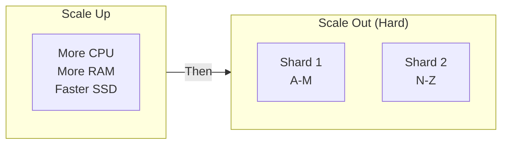
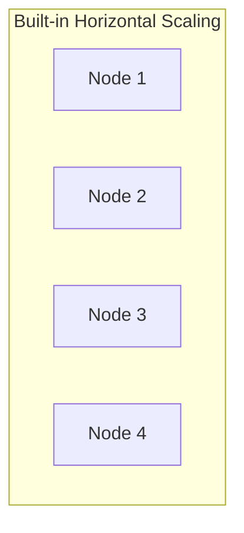

# SQL vs NoSQL: Practical Comparison

Let's explore the technical differences and when each type of database shines.

## Types of NoSQL Databases

NoSQL isn't just one thing—it's a family of database types:

| Type              | Description                 | Examples              | Use Case                          |
| ----------------- | --------------------------- | --------------------- | --------------------------------- |
| **Document**      | JSON-like documents         | MongoDB, CouchDB      | Content management, user profiles |
| **Key-Value**     | Simple key → value pairs    | Redis, DynamoDB       | Caching, sessions                 |
| **Column-Family** | Columns grouped in families | Cassandra, HBase      | Analytics, time-series            |
| **Graph**         | Nodes and relationships     | Neo4j, Amazon Neptune | Social networks, recommendations  |

## Data Modeling Differences

### Relational (SQL) - Normalized

```sql
-- Multiple tables, relationships via foreign keys
CREATE TABLE Customers (
    CustomerID INT PRIMARY KEY,
    Name VARCHAR(100)
);

CREATE TABLE Orders (
    OrderID INT PRIMARY KEY,
    CustomerID INT REFERENCES Customers,
    Total DECIMAL(10,2)
);

CREATE TABLE OrderItems (
    OrderID INT REFERENCES Orders,
    ProductID INT,
    Quantity INT
);
```

### Document (NoSQL) - Denormalized

```javascript
// Single document with embedded data
{
  "_id": "order_123",
  "customer": {
    "id": "cust_456",
    "name": "Alice Smith"
  },
  "items": [
    { "product": "Laptop", "quantity": 1, "price": 999 },
    { "product": "Mouse", "quantity": 2, "price": 25 }
  ],
  "total": 1049
}
```

<RdbmsConceptVisualizer mode="intermediate" />

## Query Comparison

### SQL Query

```sql
SELECT c.Name, SUM(o.Total) as TotalSpent
FROM Customers c
JOIN Orders o ON c.CustomerID = o.CustomerID
WHERE o.OrderDate > '2024-01-01'
GROUP BY c.Name
HAVING SUM(o.Total) > 1000;
```

### MongoDB Query

```javascript
db.orders.aggregate([
  { $match: { orderDate: { $gt: ISODate("2024-01-01") } } },
  { $group: { _id: "$customer.name", totalSpent: { $sum: "$total" } } },
  { $match: { totalSpent: { $gt: 1000 } } },
]);
```

## Scaling Strategies

### SQL (Vertical First, Then Sharding)



Cross-shard queries are complex!

### NoSQL (Designed for Scale Out)



Automatic partitioning & replication

## Consistency Models

| Model        | Description                      | Used By       |
| ------------ | -------------------------------- | ------------- |
| **Strong**   | Read always returns latest write | SQL (default) |
| **Eventual** | Reads may be stale briefly       | Most NoSQL    |
| **Causal**   | Related operations respect order | Some NoSQL    |

## Decision Matrix

| Requirement        | Choose SQL | Choose NoSQL |
| ------------------ | ---------- | ------------ |
| ACID transactions  |           | Sometimes    |
| Complex JOINs      |           |             |
| Flexible schema    |           |             |
| Horizontal scale   | Hard       |             |
| Strong consistency |           | Eventually   |
| Mature ecosystem   |           | Growing      |

<ProgressCheckpoint section="sql-vs-nosql-complete" xpReward={45} />
