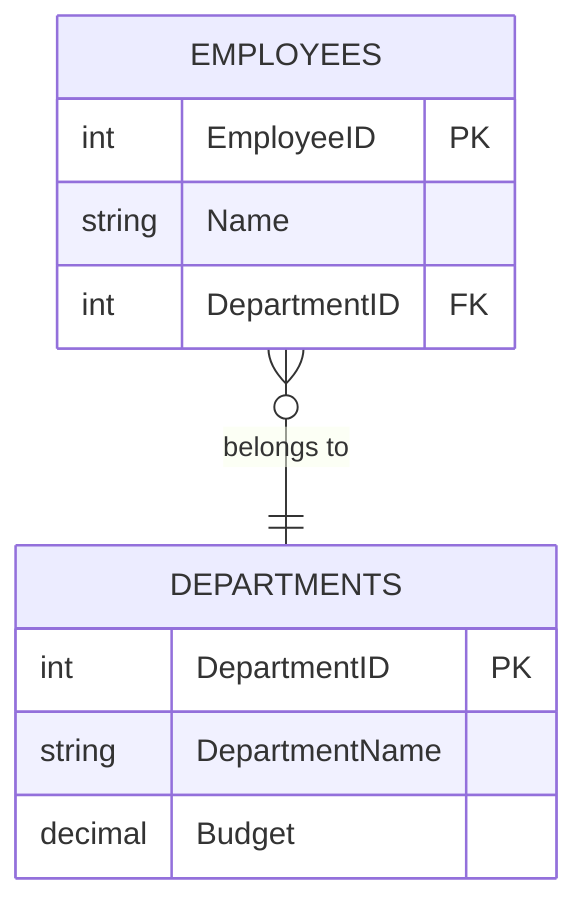

# What is a Relational Database?

Welcome to the world of data! Let's discover what relational databases are and why they're everywhere.

## ️ Think of Your Favorite Spreadsheet

Have you ever used a spreadsheet like Excel or Google Sheets? A relational database is similar, but **supercharged**:

| Spreadsheet   | Database     |
| :------------ | :----------- |
| File          | Database     |
| Sheet/Tab     | Table        |
| Row           | Record       |
| Column header | Field/Column |

> **The Big Idea:** A relational database stores data in **tables** that can be **connected** to each other!

##  Explore RDBMS Concepts

Use the interactive visualizer below to see how tables, rows, columns, and relationships work together:

<RdbmsConceptVisualizer mode="beginner" />

##  A Real-World Analogy: The Library

Imagine a library:

- **The library building** = Database
- **Card catalogs / filing cabinets** = Tables
- **Each card in the catalog** = Row (one book's info)
- **Info on the card** (title, author, ISBN) = Columns

Just like a library organizes books so you can find them, databases organize data so computers can work with it efficiently!

##  Key Terms to Remember

| Term               | What It Means                           | Example            |
| ------------------ | --------------------------------------- | ------------------ |
| **Database**       | A collection of organized data          | "Company Database" |
| **Table**          | A group of related data in rows/columns | "Employees" table  |
| **Row (Record)**   | One complete set of information         | One employee       |
| **Column (Field)** | One type of information                 | "Email" column     |

##  Why "Relational"?

The magic word is **relational**! Tables can be connected (related) to each other:

This connection lets you answer questions like:

- "Which department does Alice work in?"
- "How many employees are in Marketing?"

## Quick Check 

Before moving on, remember:

- Databases store organized data in **tables**
- Tables have **columns** (types of data) and **rows** (records)
- **Relational** means tables can connect to each other

<ProgressCheckpoint section="what-is-rdbms-complete" xpReward={20} />
