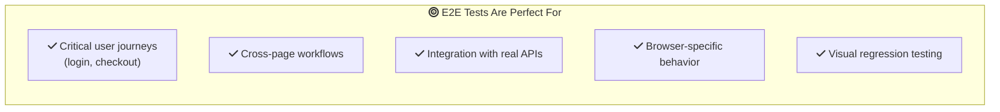

# E2E Testing with Playwright

Welcome to end-to-end testing! While unit tests check individual pieces and component tests verify UI behavior, E2E tests ensure your entire application works correctly from a real user's perspective—in an actual browser.

Think of E2E tests like a robot that uses your app exactly like a human would: opening a browser, clicking buttons, filling forms, and verifying that everything works together.

<InfoBox type="tip" title="The Final Safety Net">
E2E tests are your last line of defense before code reaches users. They catch bugs that slip through unit and component tests by testing the complete system.
</InfoBox>

<ProgressCheckpoint section="introduction" xpReward={10} />

## Why E2E Testing?

Unit and component tests are great, but they test pieces in isolation. E2E tests verify that:

- Frontend and backend work together
- Database operations complete correctly
- Authentication flows function properly
- Third-party integrations behave as expected
- The app works in real browsers

<TestPyramidExplorer highlightLayer="e2e" showMetrics={true} />

### When E2E Tests Shine



<KeyConcept title="Quality Over Quantity">
E2E tests are slower and more expensive than unit tests. Focus on critical paths—the journeys that matter most to your users and business.
</KeyConcept>

<ProgressCheckpoint section="why-e2e-testing" xpReward={10} />

## Meet Playwright

**Playwright** is a modern browser automation framework from Microsoft. It's fast, reliable, and supports all major browsers.

### Why Playwright?

- **Cross-browser**: Chrome, Firefox, Safari, Edge
- **Auto-waiting**: No manual waits or sleeps
- **Powerful selectors**: Find elements reliably
- **Parallel execution**: Run tests simultaneously
- **Trace viewer**: Debug failures visually
- **Codegen**: Generate tests by recording actions

### Installation

```bash
# Install Playwright
npm init playwright@latest

# This creates:
# - playwright.config.ts
# - tests/ folder
# - tests-examples/ folder
```

<ProgressCheckpoint section="playwright-basics" xpReward={10} />

## Your First Playwright Test

Let's write a simple test that visits a page and checks the title:

```typescript
// tests/example.spec.ts
import { test, expect } from '@playwright/test';

test('has title', async ({ page }) => {
  await page.goto('https://playwright.dev');
  
  // Expect the title to contain "Playwright"
  await expect(page).toHaveTitle(/Playwright/);
});

test('get started link', async ({ page }) => {
  await page.goto('https://playwright.dev');
  
  // Click the "Get started" link
  await page.getByRole('link', { name: 'Get started' }).click();
  
  // Expect the URL to contain "intro"
  await expect(page).toHaveURL(/.*intro/);
});
```

<E2EFlowVisualizer flowType="search" />

Let's break down what's happening:

1. **`test()`** - Defines a test with a description
2. **`page`** - A browser page (like a tab)
3. **`page.goto()`** - Navigates to a URL
4. **`page.getByRole()`** - Finds elements by accessible role
5. **`expect()`** - Makes assertions about the page

<ProgressCheckpoint section="locators-and-selectors" xpReward={15} />

## Finding Elements: Locators

Playwright uses **locators** to find elements. Like Testing Library, it prioritizes user-facing attributes:

<LocatorPlayground showRecommendations={true} />

### Recommended Locators

```typescript
// By role (best!)
page.getByRole('button', { name: 'Submit' });
page.getByRole('textbox', { name: 'Email' });
page.getByRole('link', { name: 'Sign up' });

// By label
page.getByLabel('Email address');

// By placeholder
page.getByPlaceholder('Enter your email');

// By text
page.getByText('Welcome back');

// By alt text
page.getByAltText('Company logo');

// By title
page.getByTitle('Close dialog');

// By test ID (last resort)
page.getByTestId('submit-button');
```

### Chaining Locators

```typescript
// Find a button inside a specific section
page.getByRole('article').getByRole('button', { name: 'Read more' });

// Find the first matching element
page.getByRole('listitem').first();

// Find by index
page.getByRole('listitem').nth(2);

// Filter by text
page.getByRole('listitem').filter({ hasText: 'Important' });
```

<KeyConcept title="Locators Auto-Wait">
Playwright locators automatically wait for elements to be visible and actionable. No need for manual waits or sleeps!
</KeyConcept>

<ProgressCheckpoint section="assertions-and-waits" xpReward={15} />

## Assertions

Playwright provides powerful assertions that auto-retry:

```typescript
// Page assertions
await expect(page).toHaveTitle('My App');
await expect(page).toHaveURL('/dashboard');

// Locator assertions
await expect(page.getByRole('button')).toBeVisible();
await expect(page.getByRole('button')).toBeEnabled();
await expect(page.getByRole('button')).toBeDisabled();
await expect(page.getByRole('button')).toHaveText('Submit');
await expect(page.getByRole('textbox')).toHaveValue('test@example.com');
await expect(page.getByRole('checkbox')).toBeChecked();

// Count assertions
await expect(page.getByRole('listitem')).toHaveCount(5);

// Attribute assertions
await expect(page.getByRole('link')).toHaveAttribute('href', '/home');

// CSS assertions
await expect(page.getByRole('button')).toHaveClass(/primary/);
```

<InfoBox type="tip" title="Auto-Retry Magic">
Playwright assertions automatically retry until they pass or timeout. This eliminates flaky tests caused by timing issues!
</InfoBox>

<ProgressCheckpoint section="page-object-model" xpReward={10} />

## User Actions

Simulate real user interactions:

```typescript
// Clicking
await page.getByRole('button', { name: 'Submit' }).click();
await page.getByRole('button').dblclick();
await page.getByRole('button').click({ button: 'right' });

// Typing
await page.getByLabel('Email').fill('test@example.com');
await page.getByLabel('Email').type('test@example.com'); // Types character by character
await page.getByLabel('Email').clear();

// Keyboard
await page.keyboard.press('Enter');
await page.keyboard.press('Tab');
await page.keyboard.type('Hello World');

// Selecting
await page.getByLabel('Country').selectOption('USA');
await page.getByLabel('Country').selectOption({ label: 'United States' });

// Checkboxes
await page.getByLabel('Accept terms').check();
await page.getByLabel('Accept terms').uncheck();

// Hovering
await page.getByRole('button').hover();

// Drag and drop
await page.getByTestId('source').dragTo(page.getByTestId('target'));
```

<E2EFlowVisualizer flowType="login" />

<ProgressCheckpoint section="best-practices" xpReward={10} />

## Running Tests

```bash
# Run all tests
npx playwright test

# Run specific test file
npx playwright test tests/login.spec.ts

# Run in headed mode (see the browser)
npx playwright test --headed

# Run in specific browser
npx playwright test --project=chromium
npx playwright test --project=firefox

# Run with UI mode (interactive)
npx playwright test --ui

# Debug a test
npx playwright test --debug
```

### Viewing Results

```bash
# Show HTML report
npx playwright show-report

# View trace (for failed tests)
npx playwright show-trace trace.zip
```

## Quick Quiz

<Quiz id="e2e-playwright-beginner-quiz">
  <Question text="What's the recommended way to find a button in Playwright?">
    <Answer>page.querySelector('button')</Answer>
    <Answer>page.locator('.btn-primary')</Answer>
    <Answer correct>page.getByRole('button', name)</Answer>
    <Answer>page.findElement('button')</Answer>
  </Question>
  
  <Question text="Why don't you need to add manual waits in Playwright?">
    <Answer>Playwright tests run synchronously</Answer>
    <Answer correct>Locators and assertions auto-wait for elements</Answer>
    <Answer>Playwright uses a special fast browser</Answer>
    <Answer>You do need manual waits</Answer>
  </Question>
  
  <Question text="What command runs Playwright tests with a visible browser?">
    <Answer>npx playwright test --visible</Answer>
    <Answer>npx playwright test --browser</Answer>
    <Answer correct>npx playwright test --headed</Answer>
    <Answer>npx playwright test --show</Answer>
  </Question>
</Quiz>

<ProgressCheckpoint section="summary" xpReward={10} />

## Key Takeaways

<KeyConcept title="E2E = Real User Testing">
E2E tests run in real browsers and test your complete application stack. They're your final safety net before deployment.
</KeyConcept>

<KeyConcept title="Playwright Auto-Waits">
Playwright automatically waits for elements to be ready. No more flaky tests from timing issues!
</KeyConcept>

<KeyConcept title="User-Facing Locators">
Use `getByRole`, `getByLabel`, and `getByText` to find elements the way users do. Avoid CSS selectors and test IDs when possible.
</KeyConcept>

---

**Great start!**  You've learned the fundamentals of E2E testing with Playwright. In the intermediate level, we'll explore the Page Object Model, authentication, and testing complex workflows.
