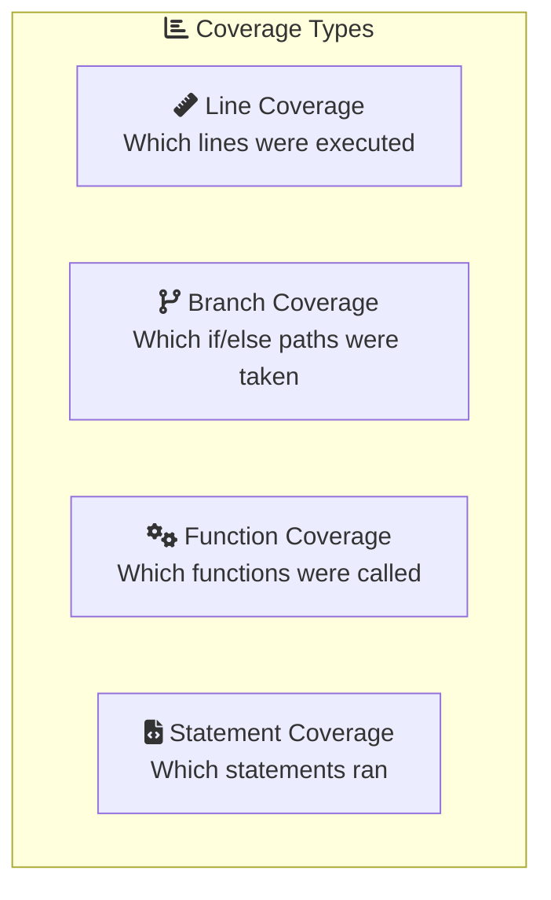
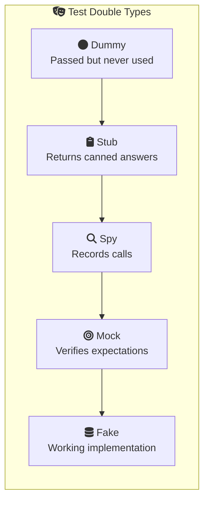

# Unit Testing with Vitest - Advanced

Welcome to the advanced level! Here we'll explore professional testing patterns, code coverage strategies, property-based testing, and techniques used in production codebases. These skills will set you apart in technical interviews and real-world projects.

<InfoBox type="info" title="Professional-Grade Testing">
This lesson covers patterns used by senior developers and in enterprise applications. Master these concepts to write tests that are maintainable, comprehensive, and truly valuable.
</InfoBox>

<ProgressCheckpoint section="introduction" xpReward={20} />

## Test Coverage: Quality Over Quantity

**Code coverage** measures how much of your code is executed during tests. But high coverage doesn't automatically mean good tests!

### Understanding Coverage Metrics



### Configuring Coverage in Vitest

```typescript
// vitest.config.ts
import { defineConfig } from 'vitest/config';

export default defineConfig({
  test: {
    coverage: {
      provider: 'v8', // or 'istanbul'
      reporter: ['text', 'html', 'lcov'],
      exclude: [
        'node_modules/',
        'test/',
        '**/*.d.ts',
        '**/*.config.*',
      ],
      thresholds: {
        lines: 80,
        branches: 80,
        functions: 80,
        statements: 80,
      },
    },
  },
});
```

<KeyConcept title="Coverage ≠ Quality">
100% coverage with bad tests is worse than 70% coverage with thoughtful tests. Coverage tells you what code ran, not whether it was tested correctly. Focus on testing behavior, not just hitting lines.
</KeyConcept>

<ProgressCheckpoint section="why-unit-testing" xpReward={20} />

## Property-Based Testing with fast-check

Traditional tests check specific examples. **Property-based testing** generates hundreds of random inputs to find edge cases you'd never think of.

```typescript
import { test, expect } from 'vitest';
import * as fc from 'fast-check';

// Traditional test: specific examples
test('reverse twice returns original', () => {
  expect(reverse(reverse('hello'))).toBe('hello');
  expect(reverse(reverse('world'))).toBe('world');
});

// Property-based test: ANY string
test('reverse twice returns original (property)', () => {
  fc.assert(
    fc.property(fc.string(), (str) => {
      expect(reverse(reverse(str))).toBe(str);
    })
  );
});
```

### Real-World Example: Testing a Sort Function

```typescript
import * as fc from 'fast-check';

describe('sort function properties', () => {
  test('output has same length as input', () => {
    fc.assert(
      fc.property(fc.array(fc.integer()), (arr) => {
        expect(sort(arr)).toHaveLength(arr.length);
      })
    );
  });

  test('output is sorted', () => {
    fc.assert(
      fc.property(fc.array(fc.integer()), (arr) => {
        const sorted = sort(arr);
        for (let i = 1; i < sorted.length; i++) {
          expect(sorted[i]).toBeGreaterThanOrEqual(sorted[i - 1]);
        }
      })
    );
  });

  test('output contains same elements', () => {
    fc.assert(
      fc.property(fc.array(fc.integer()), (arr) => {
        const sorted = sort(arr);
        expect(sorted.sort()).toEqual([...arr].sort());
      })
    );
  });
});
```

<InfoBox type="tip" title="When to Use Property-Based Testing">
Property-based testing shines for:
- Pure functions with mathematical properties
- Serialization/deserialization (encode then decode = original)
- Data transformations
- Algorithms with invariants
</InfoBox>

<ProgressCheckpoint section="vitest-basics" xpReward={25} />

## Test Doubles: Mocks, Stubs, Spies, and Fakes

Understanding the different types of test doubles helps you choose the right tool:



| Type | Purpose |
|:---:|:---|
| **Dummy** | Placeholder, never actually used |
| **Stub** | Returns canned answers, no verification |
| **Spy** | Records calls, may call real implementation |
| **Mock** | Pre-programmed expectations, verifies calls |
| **Fake** | Working implementation (e.g., in-memory DB) |

### Implementing a Fake

```typescript
// Real repository
class UserRepository {
  async findById(id: string): Promise<User | null> {
    return await database.query('SELECT * FROM users WHERE id = ?', [id]);
  }
  
  async save(user: User): Promise<void> {
    await database.query('INSERT INTO users ...', [user]);
  }
}

// Fake repository for testing
class FakeUserRepository {
  private users: Map<string, User> = new Map();
  
  async findById(id: string): Promise<User | null> {
    return this.users.get(id) || null;
  }
  
  async save(user: User): Promise<void> {
    this.users.set(user.id, user);
  }
  
  // Test helper
  clear(): void {
    this.users.clear();
  }
}
```

<ProgressCheckpoint section="writing-tests" xpReward={25} />

## Testing Error Handling

Robust applications handle errors gracefully. Your tests should verify this:

```typescript
describe('error handling', () => {
  test('throws for invalid input', () => {
    expect(() => divide(10, 0)).toThrow('Cannot divide by zero');
  });

  test('throws specific error type', () => {
    expect(() => parseConfig(null)).toThrow(ValidationError);
  });

  test('async function rejects with error', async () => {
    await expect(fetchUser(-1)).rejects.toThrow('Invalid user ID');
  });

  test('error contains helpful information', () => {
    try {
      parseConfig({ invalid: true });
      expect.fail('Should have thrown');
    } catch (error) {
      expect(error).toBeInstanceOf(ValidationError);
      expect(error.message).toContain('invalid');
      expect(error.field).toBe('config');
    }
  });
});
```

### Testing Error Boundaries

```typescript
test('recovers from errors gracefully', async () => {
  const mockApi = vi.fn()
    .mockRejectedValueOnce(new Error('Network error'))
    .mockResolvedValueOnce({ data: 'success' });

  const result = await fetchWithRetry(mockApi, { retries: 2 });
  
  expect(mockApi).toHaveBeenCalledTimes(2);
  expect(result).toEqual({ data: 'success' });
});
```

<ProgressCheckpoint section="assertions" xpReward={25} />

## Snapshot Testing

Snapshots capture output and alert you when it changes:

```typescript
import { expect, test } from 'vitest';

test('renders user profile correctly', () => {
  const profile = renderUserProfile({
    name: 'Alice',
    email: 'alice@example.com',
    role: 'admin',
  });
  
  expect(profile).toMatchSnapshot();
});

// Inline snapshots (stored in the test file)
test('formats date correctly', () => {
  const formatted = formatDate(new Date('2024-01-15'));
  expect(formatted).toMatchInlineSnapshot(`"January 15, 2024"`);
});
```

<InfoBox type="warning" title="Snapshot Best Practices">
- Keep snapshots small and focused
- Review snapshot changes carefully in PRs
- Don't snapshot implementation details
- Use inline snapshots for small outputs
</InfoBox>

<ProgressCheckpoint section="mocking" xpReward={25} />

## Parameterized Tests

Test multiple scenarios without duplicating code:

```typescript
import { describe, test, expect } from 'vitest';

describe('isValidEmail', () => {
  test.each([
    ['test@example.com', true],
    ['user.name@domain.org', true],
    ['invalid-email', false],
    ['@nodomain.com', false],
    ['spaces in@email.com', false],
  ])('isValidEmail("%s") returns %s', (email, expected) => {
    expect(isValidEmail(email)).toBe(expected);
  });
});

// With objects for complex cases
describe('calculateDiscount', () => {
  test.each([
    { price: 100, tier: 'bronze', expected: 95 },
    { price: 100, tier: 'silver', expected: 90 },
    { price: 100, tier: 'gold', expected: 80 },
    { price: 100, tier: 'platinum', expected: 70 },
  ])('$tier tier: $price -> $expected', ({ price, tier, expected }) => {
    expect(calculateDiscount(price, tier)).toBe(expected);
  });
});
```

## Testing Private Functions

Should you test private functions? Generally, no—test through the public API. But sometimes you need to:

```typescript
// Option 1: Export for testing (not ideal)
export const _internal = {
  validateInput,
  formatOutput,
};

// Option 2: Test through public API (preferred)
test('public function handles edge cases', () => {
  // This implicitly tests the private validation
  expect(() => publicFunction(null)).toThrow();
  expect(publicFunction(validInput)).toBeDefined();
});

// Option 3: Extract to separate module if complex enough
// If private logic is complex enough to need direct tests,
// it might deserve its own module with public exports
```

<ProgressCheckpoint section="best-practices" xpReward={20} />

## Performance Testing

Ensure your code performs well:

```typescript
import { bench, describe } from 'vitest';

describe('performance', () => {
  bench('array sort', () => {
    const arr = Array.from({ length: 1000 }, () => Math.random());
    arr.sort((a, b) => a - b);
  });

  bench('custom sort', () => {
    const arr = Array.from({ length: 1000 }, () => Math.random());
    customSort(arr);
  });
});
```

### Testing for Performance Regressions

```typescript
test('processes large dataset within time limit', async () => {
  const largeDataset = generateTestData(10000);
  
  const start = performance.now();
  await processData(largeDataset);
  const duration = performance.now() - start;
  
  expect(duration).toBeLessThan(1000); // Must complete in < 1 second
});
```

## Test Organization Patterns

### Arrange-Act-Assert (AAA)

```typescript
test('user can update their profile', async () => {
  // Arrange
  const user = await createTestUser();
  const newData = { name: 'New Name' };
  
  // Act
  const updated = await updateProfile(user.id, newData);
  
  // Assert
  expect(updated.name).toBe('New Name');
  expect(updated.updatedAt).toBeDefined();
});
```

### Given-When-Then (BDD Style)

```typescript
describe('Shopping Cart', () => {
  describe('given an empty cart', () => {
    describe('when adding an item', () => {
      test('then cart contains one item', () => {
        const cart = new ShoppingCart();
        cart.add({ id: '1', price: 10 });
        expect(cart.items).toHaveLength(1);
      });
      
      test('then total equals item price', () => {
        const cart = new ShoppingCart();
        cart.add({ id: '1', price: 10 });
        expect(cart.total).toBe(10);
      });
    });
  });
});
```

## Quick Quiz

<Quiz id="unit-testing-advanced-quiz">
  <Question text="What does property-based testing do differently from traditional tests?">
    <Answer>It runs tests in parallel</Answer>
    <Answer>It tests private functions</Answer>
    <Answer correct>It generates random inputs to find edge cases</Answer>
    <Answer>It measures code coverage</Answer>
  </Question>
  
  <Question text="What's the difference between a Mock and a Fake?">
    <Answer>Mocks are faster than Fakes</Answer>
    <Answer correct>Fakes have working implementations, Mocks verify expectations</Answer>
    <Answer>Fakes can only be used with databases</Answer>
    <Answer>There is no difference</Answer>
  </Question>
  
  <Question text="Why might 100% code coverage be misleading?">
    <Answer>Coverage tools are inaccurate</Answer>
    <Answer correct>Coverage shows what ran, not whether it was tested correctly</Answer>
    <Answer>100% coverage is impossible to achieve</Answer>
    <Answer>Coverage doesn't include async code</Answer>
  </Question>
</Quiz>

<ProgressCheckpoint section="summary" xpReward={15} />

## Key Takeaways

<KeyConcept title="Coverage is a Tool, Not a Goal">
Use coverage to find untested code, but focus on testing behavior and edge cases. Quality tests matter more than quantity.
</KeyConcept>

<KeyConcept title="Property-Based Testing Finds Bugs">
Let the computer generate test cases. Property-based testing with fast-check discovers edge cases you'd never think to test manually.
</KeyConcept>

<KeyConcept title="Choose the Right Test Double">
Understand when to use mocks, stubs, spies, and fakes. Each has its place depending on what you're testing and verifying.
</KeyConcept>

---

**Congratulations!** 🏆 You've mastered advanced unit testing with Vitest. You now have the skills to write professional-grade tests that catch bugs, document behavior, and give you confidence in your code.
